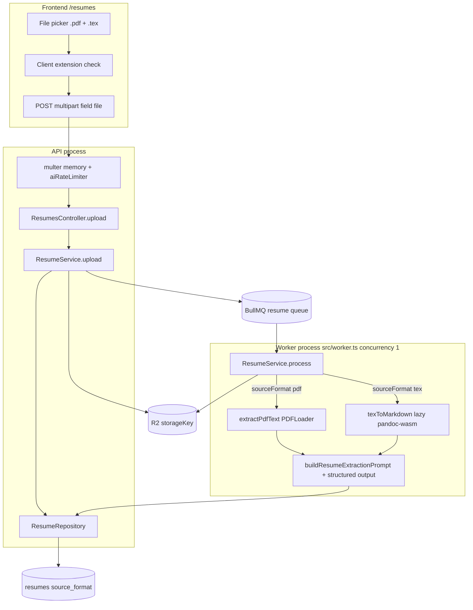
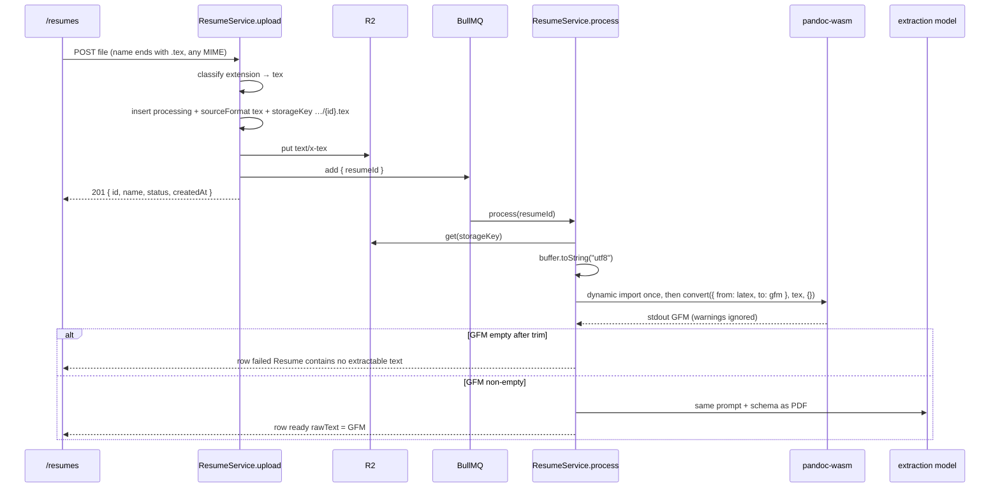

# Resume TeX Upload — Design

**Spec**: `.specs/features/resume-tex-upload/spec.md`  
**Status**: Approved (tasks drafted)

---

## Architecture Overview

Keep the existing **one route / one BullMQ job / one worker** for résumés. Upload classifies `.pdf` vs `.tex` by **filename extension** (MIME is ignored), stores bytes in R2 under `storageKey` with the real extension, and persists `sourceFormat`. The worker `process()` dispatches: PDF → current `extractPdfText` / `PDFLoader`; TeX → UTF-8 decode → `pandoc-wasm` `{ from: "latex", to: "gfm" }` → same `buildResumeExtractionPrompt` + `withStructuredOutput(structuredSummarySchema)`. `rawText` is always what the LLM saw (PDF text or GFM). Preview/detail JSON stays `{ id, name, status, createdAt }` (+ `structuredSummary` when ready).

`pandoc-wasm@1.1.0` **must not** be statically imported: its Node entry instantiates WASM with top-level `await` on module load. The converter uses a **module-level dynamic-import singleton** so PDF-only worker traffic never loads WASM.





---

## Research Notes

Verified against npm `pandoc-wasm@1.1.0` README + `src/index.node.js` / `src/core.js` (not assumed from training data).

| Fact | Source |
| ---- | ------ |
| Modern API: `convert(options, stdin, files)` → `{ stdout, stderr, warnings, files, mediaFiles }` | [README](https://github.com/pandoc/pandoc-wasm/blob/master/README.md) |
| TeX path: `convert({ from: "latex", to: "gfm" }, texString, {})` | Same + RTX-DEC-08 |
| License **GPL-2.0-or-later** (WASM binary); JS wrapper MIT; npm package is GPL | npm + README |
| Node entry **reads `pandoc.wasm` and `await createPandocInstance` at import time** | `src/index.node.js` |
| Default entry `src/index.js` picks Node if `process.versions.node` is set (Bun sets this) | `src/index.js` |
| WASM sandbox: no HTTP, no `\input` sibling files unless passed in `files` | README limitations; matches RTX-DEC-02 / RTX-DEC-07 |
| Types: package does **not** ship `.d.ts` | npm 1.1.0 package contents |

**Uncertain (gated, not assumed):** first `WebAssembly.instantiate` + `@bjorn3/browser_wasi_shim` under **Bun** in Linux CI. If that live test fails, that is the native-`pandoc` blocker already out of this spec — do not silently swap engines.

`mermaid-studio` / `codenavi` skills are not installed; diagrams are inline mermaid; code reuse was traced with repo search.

---

## Code Reuse Analysis

### Existing Components to Leverage

| Component | Location | How to Use |
| --------- | -------- | ---------- |
| `POST /api/resumes/` | `backend/src/modules/resumes/routes/resumes-routes.ts` | Same path, field `file`, `aiRateLimiter`, multer memory + `RESUME_MAX_BYTES` |
| `ResumeService.uploadPdf` / `process` | `backend/src/modules/resumes/service/resume-service.ts` | Rename upload; dispatch in `process` by `sourceFormat` |
| `extractPdfText` | `backend/src/infrastructure/document-parsing/pdf-text-extractor.ts` | Unchanged; PDF branch only |
| `buildResumeExtractionPrompt` + `structuredSummarySchema` | `modules/resumes/prompts/` + `validations/` | Shared; GFM occupies the résumé-text block |
| `IObjectStorage.put(key, body, contentType)` | `protocols/object-storage.ts` + `r2-client.ts` | Pass `text/x-tex` vs `application/pdf` |
| Resume queue + worker | `infrastructure/queue/resume-queue.ts`, `src/worker.ts` | Job payload unchanged `{ resumeId }`; keep `concurrency: 1` |
| `toResumePreview` / `toResumeDetail` | `resume-service.ts` | Still omit `sourceFormat`, `storageKey`, `rawText`, `errorMessage` |
| Multer `LIMIT_FILE_SIZE` | `error-handler-middleware.ts` | Unchanged global `"File exceeds maximum allowed size"` (shared with transcribe) |
| Seed helper | `backend/src/test/helpers/interview-seed-helpers.ts` | Drop `pdfUrl`; set `sourceFormat: pdf` |
| `/resumes` page + `uploadResume` | `frontend/src/app/(app)/resumes/page.tsx`, `frontend/src/lib/api/resumes.ts` | Same POST; picker/copy/guard only |
| API contract doc | `backend/docs/frontend-mock-interview-api.md` | Extension-based validation + new 400 copy |

### Integration Points

| System | Integration Method |
| ------ | ------------------ |
| PostgreSQL | Migration: enum `ResumeSourceFormat`, column `source_format` NOT NULL backfill `pdf`, drop `pdf_url` |
| R2 | Key `users/{userId}/resumes/{id}.pdf\|.tex`; Content-Type by format |
| BullMQ | No new queue; existing resume worker |
| `pandoc-wasm` | Worker-only via dynamic import inside converter |
| Frontend | Same `/api/resumes/` contract; no new fields |

### Fragile / wide blast radius

`.specs/codebase/CONCERNS.md` does not exist. Practical risk: **`pdfUrl` is duplicated on every resume seed** (`interview-seed-helpers`, six interview/review integration tests, `ResumeRecord`, repository). Design treats dropping `pdfUrl` as a single mechanical sweep in `backend/src` + tests — not a behavioral change for interview/review.

---

## Components

### 1. Prisma `ResumeSourceFormat` + drop `pdfUrl`

- **Purpose**: Persist how bytes should be interpreted; stop duplicating the R2 key as `pdfUrl`.
- **Location**: `backend/prisma/schema/ai-mock-interview.prisma` + new migration `YYYYMMDDHHMMSS_resume_source_format`
- **Interfaces**:
  - Enum `ResumeSourceFormat { pdf tex }`
  - `Resume.sourceFormat ResumeSourceFormat @map("source_format")`
  - Remove `pdfUrl` / `pdf_url`
- **Migration SQL** (Prisma generate + this intent):

```sql
CREATE TYPE "ResumeSourceFormat" AS ENUM ('pdf', 'tex');

ALTER TABLE "resumes" ADD COLUMN "source_format" "ResumeSourceFormat";

UPDATE "resumes" SET "source_format" = 'pdf' WHERE "source_format" IS NULL;

ALTER TABLE "resumes" ALTER COLUMN "source_format" SET NOT NULL;

ALTER TABLE "resumes" DROP COLUMN "pdf_url";
```

- **Dependencies**: Prisma migrate deploy in existing Docker entrypoint
- **Reuses**: Enum style of `SessionQuotaKind` / `InterviewLocale`

### 2. Domain types + extension classifier

- **Purpose**: Single source of truth for allowed extensions and R2 metadata.
- **Location**: `backend/src/modules/resumes/types/resume-record.ts` (add format constants) + `backend/src/modules/resumes/source-format.ts`
- **Interfaces**:

```typescript
export const RESUME_SOURCE_FORMATS = ["pdf", "tex"] as const;
export type ResumeSourceFormat = (typeof RESUME_SOURCE_FORMATS)[number];

export function classifyResumeSourceFormat(
  originalname: string,
): ResumeSourceFormat | null;

export function resumeStorageKey(
  userId: number,
  resumeId: string,
  format: ResumeSourceFormat,
): string; // users/{userId}/resumes/{resumeId}.pdf|tex

export function resumeContentType(format: ResumeSourceFormat): string;
// pdf → application/pdf; tex → text/x-tex
```

Classification: ASCII case-insensitive **suffix** `.pdf` / `.tex` on `originalname`. MIME ignored. Anything else → `null` (400). `CV.TEX` → `tex`. `notes.txt` → `null`. A `.tex` named with `Content-Type: application/pdf` is still `tex`.

- **Dependencies**: none
- **Reuses**: same const-array + `satisfies Record` pattern as `RESUME_STATUS`

`ResumeRecord` drops `pdfUrl`, adds `sourceFormat: ResumeSourceFormat`. Keep mapping `updatedAt` from `createdAt` (existing quirk, out of scope).

### 3. `ResumeRepository.createProcessing`

- **Purpose**: Persist processing rows without `pdfUrl`.
- **Location**: `backend/src/modules/resumes/repository/resume-repository.ts`
- **Interfaces**:
  - `createProcessing(userId, name, storageKey, sourceFormat, id?): Promise<ResumeRecord>` — **remove** `pdfUrl` argument
  - `toResumeRecord` maps `sourceFormat`, does not read `pdfUrl`
- **Dependencies**: Prisma client after generate
- **Reuses**: existing `updateReady` / `updateFailed` / finders (unchanged)

Call sites to update in the same change: `session-repository.integration.test.ts` and other `createProcessing(` usages.

### 4. `ResumeService.upload` (renamed from `uploadPdf`)

- **Purpose**: Validate, persist, store, enqueue — format-neutral.
- **Location**: `backend/src/modules/resumes/service/resume-service.ts`
- **Interfaces**:
  - `upload(userId: number, file: Express.Multer.File): Promise<ResumePreview>`
  - `private validateResumeFile(file): ResumeSourceFormat` — throws `BadRequestError`
- **Validation** (RTX-01–05):

| Condition | HTTP | `message` |
| --------- | ---- | --------- |
| Missing file (controller + service) | 400 | `Resume file is required` |
| Extension not `.pdf` / `.tex` | 400 | `Only PDF and TeX files are allowed` |
| `file.size > maxBytes` (defense in depth) | 400 | `File must be at most ${maxBytes} bytes` |
| Multer `LIMIT_FILE_SIZE` (HTTP path, before service) | 400 | existing `File exceeds maximum allowed size` |

HTTP oversized hits **multer first** (same as today and as transcribe). RTX-05 is the service-level string. Do not change the global multer mapper (would break transcribe E2E).

Storage/enqueue errors — **status codes unchanged**; copy generalized (PDF-only strings are wrong for TeX):

| Failure | HTTP | Client `message` | Row `errorMessage` |
| ------- | ---- | ---------------- | ------------------ |
| `storage.put` | 502 | `Failed to upload resume` | `Failed to upload resume to storage` |
| `queue.add` | 503 | `Resume processing is unavailable` | `Failed to enqueue resume processing` (already neutral) |

201 body: `toResumePreview` only. Controller calls `upload` instead of `uploadPdf`.

- **Dependencies**: repository, `IObjectStorage`, `IResumeQueue`, classifier
- **Reuses**: existing try/catch around put/enqueue

### 5. `texToMarkdown` (lazy pandoc-wasm)

- **Purpose**: Convert TeX bytes to GFM; isolate WASM and clean errors.
- **Location**: `backend/src/infrastructure/document-parsing/tex-to-markdown.ts` (beside `pdf-text-extractor.ts`)
- **Interfaces**:
  - `export type TexToMarkdown = (buffer: Buffer) => Promise<string>`
  - `export async function texToMarkdown(buffer: Buffer): Promise<string>`
- **Behavior**:
  1. `const texString = buffer.toString("utf8")` (no encoding sniff)
  2. `const convert = await getPandocConvert()` where `getPandocConvert` holds a **module-level** `Promise<ConvertFn> | null` and does `import("pandoc-wasm")` only once
  3. `const result = await convert({ from: "latex", to: "gfm" }, texString, {})`
  4. Return `result.stdout ?? ""` (caller trims). **Do not** treat `warnings` / `stderr` as failure
  5. **Do not** scan `\input` / `\include`; do not pass extra `files`
  6. On throw: log is the worker’s job via `cause`; throw `new Error("Failed to convert TeX resume")` with **no** WASM/stack in `message`
- **Dependencies**: `pandoc-wasm@1.1.0` exact pin in `backend/package.json`
- **Reuses**: same infra folder as PDF extractor; same `(buffer) => Promise<string>` shape for injection
- **Types**: add `backend/src/types/pandoc-wasm.d.ts` (minimal `convert` signature) because the package has no typings
- **Static import ban**: this module must not `import "pandoc-wasm"` at top level. Factory may statically import `texToMarkdown` — that must not load WASM.

### 6. `ResumeService.process` dispatch

- **Purpose**: Format-specific extract → shared LLM path.
- **Location**: same service
- **Constructor**: add `texToMarkdown: TexToMarkdown` next to existing `extractText` (keep PDF extractor name in tests as `extractPdfText` / `extractText`)
- **Flow**:
  1. `assertWithinLimit` (unchanged, **before** conversion so empty-token users fail without WASM)
  2. `objectStorage.get(storageKey)`
  3. `sourceFormat === "tex"` → `texToMarkdown(buffer)`; else → `extractText(buffer)` (PDF, including backfilled rows)
  4. If `!text.trim()` → throw `Error("Resume contains no extractable text")` — **do not** call LLM
  5. `buildResumeExtractionPrompt(text)` + `withStructuredOutput(structuredSummarySchema)` unchanged
  6. `updateReady(id, summary, text)` — `rawText` is GFM for TeX, PDF text for PDF
  7. `TokenLimitExceededError` and retry-exhaust paths unchanged (message = `error.message` without stack, as today)
- **PDF jobs** must not call `texToMarkdown` (unit assertion).
- **Dependencies**: both extractors, token usage, prompt, repository
- **Reuses**: entire existing LLM + usage-capture block

### 7. Factory + worker

- **Purpose**: Wire real extractors; no eager WASM.
- **Location**: `backend/src/factories/resumes/resume-service-factory.ts`
- **Interfaces**: pass `texToMarkdown` into `ResumeService`; worker `makeResumeService()` unchanged besides the extra arg
- **Worker**: leave `concurrency: 1`. No mutex. Do **not** `import("pandoc-wasm")` in `worker.ts`.
- **Docker**: worker already runs `bun run src/worker.ts` on the image that copies `node_modules` — `pandoc.wasm` ships inside the npm package (`files` includes `src/pandoc.wasm`). No native TeX packages.

### 8. Frontend `/resumes`

- **Purpose**: Let candidates pick `.tex` without a second flow.
- **Location**: `frontend/src/app/(app)/resumes/page.tsx` + small helper `frontend/src/lib/resumes/is-allowed-resume-file.ts`
- **Interfaces**:
  - `isAllowedResumeFile(file: File): boolean` — same suffix rule as the API (`file.name`)
  - `accept=".pdf,.tex,application/pdf"`
- **Copy** (format-neutral):
  - Empty picker: PDF and LaTeX (`.tex`) supported — not “Only PDF files are supported”
  - Selected: filename + size (`X.XX MB`) — not “PDF selected”
  - Submit: `Upload resume` / existing uploading label — not “Upload PDF Resume”
  - Empty list: first resume, not “first PDF resume”
- **Guard**: disallowed extension → set inline error consistent with `Only PDF and TeX files are allowed`, **do not** call `uploadResume`
- **POST**: existing `uploadResume` (`file` field) + 201 polling unchanged
- **Out of page but same product copy**: `frontend/src/app/(app)/profile/page.tsx` empty-state still says “Upload a PDF resume first” — update that one string so the product does not contradict `/resumes`. No new API usage.
- **Dependencies**: existing `uploadResume` / react-query invalidation
- **Reuses**: toast + inline `uploadError` for 400/502/503 `message`

### 9. Docs + CI gate

- **Purpose**: Contract and the real WASM proof.
- **Location**: `backend/docs/frontend-mock-interview-api.md`; `backend/package.json`; `.github/workflows/backend-ci.yml`; `backend/docs/TESTING.md` (one row)
- **Doc changes**: `POST /api/resumes` classified by **extension** `.pdf` / `.tex`; MIME not authoritative; 400 messages above; 201 shape unchanged (no `sourceFormat`); overview “multipart PDF” → résumé file; failed GET still does not expose `errorMessage`.
- **Live WASM test**: `backend/src/infrastructure/document-parsing/tex-to-markdown.bun.test.ts`
  - Excluded from Vitest (`exclude: ["**/*.bun.test.ts"]`)
  - Script `"test:pandoc-wasm": "bun test src/infrastructure/document-parsing/tex-to-markdown.bun.test.ts"`
  - Fixture: `\documentclass{article}\begin{document}Jane Doe\end{document}` → non-empty GFM containing `Jane Doe`
  - Added to **CI quality** after `bun run test` and to `test:all` so PR CI actually runs WASM under **Bun** (worker runtime). Husky stays Vitest-only (keep pre-commit fast).

---

## Data Models

### Prisma / DB

```prisma
enum ResumeSourceFormat {
  pdf
  tex
}

model Resume {
  id                String             @id @default(uuid())
  userId            Int
  name              String
  storageKey        String             @map("storage_key")
  sourceFormat      ResumeSourceFormat @map("source_format")
  structuredSummary Json?              @map("structured_summary")
  rawText           String?            @map("raw_text") @db.Text
  status            ResumeStatus       @default(processing)
  errorMessage      String?            @map("error_message") @db.Text
  createdAt         DateTime           @default(now()) @map("created_at")
  // pdfUrl removed
}
```

**Relationships**: unchanged (`User`, `InterviewSession`). Existing rows → `source_format = pdf`; `storage_key` untouched.

### Application

```typescript
type ResumeRecord = {
  id: string;
  userId: number;
  name: string;
  status: ResumeStatus;
  sourceFormat: ResumeSourceFormat;
  storageKey: string;
  structuredSummary: unknown | null;
  rawText: string | null;
  errorMessage: string | null;
  createdAt: Date;
  updatedAt: Date;
};

type ResumePreview = {
  id: string;
  name: string;
  status: ResumeStatus;
  createdAt: Date;
};
```

Clients never receive `sourceFormat`, `storageKey`, `rawText`, `errorMessage`, or file bytes.

### R2 object

| Format | Key | Content-Type |
| ------ | --- | ------------ |
| pdf | `users/{userId}/resumes/{resumeId}.pdf` | `application/pdf` |
| tex | `users/{userId}/resumes/{resumeId}.tex` | `text/x-tex` |

Original TeX bytes stay in R2; `rawText` is GFM after success.

---

## Error Handling Strategy

| Error scenario | Handling | User impact |
| -------------- | -------- | ----------- |
| No file | 400 `Resume file is required` | Inline + toast |
| Bad extension (API) | 400 `Only PDF and TeX files are allowed`; no R2/queue | Inline + toast |
| Bad extension (UI) | Same message; no request | Inline error |
| Oversize (HTTP/multer) | 400 `File exceeds maximum allowed size` | Same as today |
| Oversize (service) | 400 `File must be at most N bytes` | Direct callers / defense in depth |
| R2 put fail | Row `failed`; 502 `Failed to upload resume` | Toast |
| Enqueue fail | Row `failed`; 503 unchanged | Toast |
| Empty PDF text / empty GFM | Row `failed`; `Resume contains no extractable text`; no LLM | Polling → failed card |
| `pandoc-wasm` throw | Row `failed`; `Failed to convert TeX resume`; stack only in worker logs | Failed card |
| Pandoc warnings + non-empty stdout | Proceed | Success path |
| `\input` without siblings | Best-effort GFM (missing chunks omitted); fail only if empty | May extract incompletely |
| LLM retries exhaust / token cap | Existing messages | Unchanged |
| Unauthenticated | 401 | Unchanged |

GET/list still omit `errorMessage`; UI keeps a generic failed state plus re-upload.

---

## Tech Decisions (non-obvious)

| Decision | Choice | Rationale |
| -------- | ------ | --------- |
| How to get a WASM singleton without loading it on PDF jobs | `import("pandoc-wasm")` behind a module-level promise inside `texToMarkdown` | Package Node entry instantiates WASM at import; static import would load WASM on worker boot via the factory |
| Where conversion runs | Worker `process()`, not the upload request | RTX-DEC-03; upload stays fast; GPL/WASM stays off the API hot path |
| Clean TeX errors | Dedicated message in the converter, not `error.message` from WASI | Spec forbids stack leak; PDFLoader still surfaces its own messages |
| `createProcessing` arity | Drop `pdfUrl` param entirely | Column gone; passing a duplicate key was AMI-DEC-05 leftover |
| HTTP oversize vs RTX-05 string | Keep global multer message | Shared with transcribe; changing it is out of scope |
| 502 copy | Generalize “PDF” → “resume” | Status/flow unchanged (RTX-09); Goals require generalized error copy |
| Live WASM runner | `bun test` file excluded from Vitest; CI quality + `test:all` | Spec RTX-21 / DEC-10: one real run under Bun, not Node/Vitest |
| Pin | `"pandoc-wasm": "1.1.0"` exact | RTX-DEC-03 / RTX-17 |
| FE helper duplication | Copy extension rule in FE; do not share a package | Separate apps; keep one function so `/resumes` cannot drift |

Grill decisions RTX-DEC-01–15 are locked (extension classification, single file, GFM, no client `sourceFormat`, UTF-8, same prompt, lazy WASM, FE in the same delivery).

---

## Testing Strategy

| Layer | What | Gate |
| ----- | ---- | ---- |
| Unit `source-format.test.ts` | Suffix case, MIME ignored, `.txt` → null, storage key + content-type | `bun run test` |
| Unit `tex-to-markdown.test.ts` | Mock `pandoc-wasm`: UTF-8 string passed in, `{ from, to }` + `{}` files, warnings ignored, throw → `Failed to convert TeX resume` | `bun run test` |
| Unit `resume-service.test.ts` | `upload` TeX + spoof MIME; PDF still works; 201 has no `sourceFormat`; `process` PDF never calls `texToMarkdown`; TeX uses GFM as `rawText`; empty text message; mocked converter | `bun run test` |
| Live `tex-to-markdown.bun.test.ts` | Real `pandoc-wasm` + Jane Doe fixture | `bun run test:pandoc-wasm` |
| Integration repository | `createProcessing` with `sourceFormat`; no `pdfUrl` | `bun run test:integration` |
| E2E `resumes.e2e.test.ts` | `cv.tex` + `contentType: text/plain` → 201, `put` with `…/{id}.tex` + `text/x-tex`; `notes.txt` → 400 new copy; PDF 201; no file → `Resume file is required`; preview GET has no `sourceFormat` | `bun run test:e2e` |
| FE | No runner (existing constraint). Execute: browser on `/resumes` (tex success, txt reject, PDF success) | UAT |

Seed/fixtures: every `pdfUrl:` in `backend/src` production + tests must disappear with the schema change.

---

## Requirement Mapping

| ID | Component |
| -- | --------- |
| RTX-01, RTX-02, RTX-03 | Classifier + `validateResumeFile` |
| RTX-04 | Controller + service missing-file |
| RTX-05 | Service size check (multer remains for HTTP) |
| RTX-06, RTX-07 | `upload` storage key + content-type |
| RTX-08 | `toResumePreview` / GET detail |
| RTX-09 | 401 middleware; 502/503 status; generalized 502 copy |
| RTX-10 | `process` PDF branch |
| RTX-11, RTX-16, RTX-17 | `texToMarkdown` + pin |
| RTX-12, RTX-13 | Shared LLM + `updateReady` |
| RTX-14, RTX-15 | Empty-text + converter error |
| RTX-18 | `/resumes` (+ profile one-liner) |
| RTX-19 | Prisma migration |
| RTX-20 | Rename upload API + `frontend-mock-interview-api.md` |
| RTX-21 | Mocked service tests + bun live test + E2E |

---

## Implementation order (for Tasks)

1. Schema migration + types/repository/seeds (`pdfUrl` gone) — unblocks `check-types`
2. Classifier + `upload` rename + E2E/unit upload strings
3. `texToMarkdown` + pin + bun live test
4. `process` dispatch + service unit tests
5. Docs + FE picker
6. `test:all` + browser UAT

Design approved 2026-08-29. Tasks: `.specs/features/resume-tex-upload/tasks.md`.
