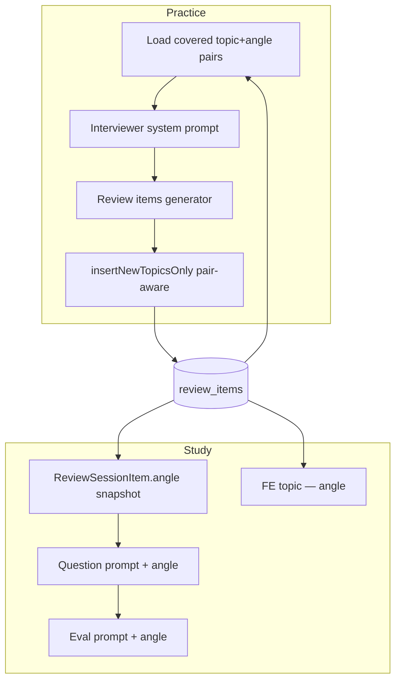

# Review Item Angles — Design

**Spec**: `.specs/features/review-item-angles/spec.md`  
**Context**: `.specs/features/review-item-angles/context.md`  
**Status**: Approved (locked from plan)

---

## Architecture Overview

Extend `review_items` with `angle`, change uniqueness to `(userId, topic, angle)`, and thread `angle` through generation, merge, APIs, Study prompts/UI, and Practice interviewer coverage.



---

## Data Model

### `ReviewItem`

| Column | Change |
|--------|--------|
| `angle` | `String` NOT NULL |
| Unique | Drop `@@unique([userId, topic])`; add `@@unique([userId, topic, angle])` |

### `ReviewSessionItem`

| Column | Change |
|--------|--------|
| `angle` | `String` NOT NULL (snapshot at session create) |

### Migration

1. Add nullable `angle`
2. `UPDATE review_items SET angle = 'general' WHERE angle IS NULL`
3. Same for `review_session_items` (join via `review_item_id` or default `'general'`)
4. Set NOT NULL
5. Drop old unique; create new unique on `(user_id, topic, angle)`

Normalize: store `topic` and `angle` lowercased (same as today’s topic).

### Similarity

Replace topic-only `findSimilarByUserIdAndTopic` with pair lookup:

```sql
similarity("topic" || ' ' || "angle", $topic || ' ' || $angle) >= 0.7
```

Keep exact case-insensitive find on `(userId, topic, angle)`.

---

## Components

| Component | Location | Change |
|-----------|----------|--------|
| Prisma models | `ai-mock-interview.prisma` | `angle` + unique |
| `ReviewItemRecord` / upsert params | `review-item-record.ts`, `review-repository.ts` | `angle` field; pair upsert key |
| `ReviewMergeService` | `review-merge-service.ts` | `ReviewItemInput.angle`; pair-aware insert/upsert |
| Generator Zod + prompt | `interview-schemas.ts`, `review-items-generator-prompt.ts` | require `angle`; instructions |
| Adapter existing items | `review-items-generator-adapter.ts` | pass `angle` in existingItems |
| Interview graph state/input | `interview-state.ts`, `interview-graph.ts`, `build-interview-graph.ts` | `coveredAngles` |
| Interviewer prompt | `interviewer-system-prompt.ts` | covered-angles block + variety rule |
| Stream service | `stream-service.ts` | load covered angles via `ReviewRepository.listByUserId` |
| Review session create/snapshot | `review-sessions-service.ts`, repository | snapshot `angle` |
| Question/eval prompts | review-session `*-prompt.ts` + protocols | include `angle` |
| API schemas | `review-items-schemas.ts`, session response mappers | expose `angle` |
| FE types + cards | `types/review-items.ts`, study cards, dashboard grid, report | display `topic — angle` |

---

## Prompt Contracts

### Generator

- Emit `{ topic, angle, description, priority }`
- `angle`: 2–8 words, specific probe; do not use vague labels (`general`, `basics`) for **new** items
- One item per distinct `(topic, angle)`; reuse exact strings when matching existing list
- Existing items JSON includes `angle`

### Interviewer (Practice)

- Section `## Already covered angles` with JSON array of `{ topic, angle }` (active + learned)
- Instruction: prefer facets not in that list; do not rehash covered angles except one brief natural follow-up
- Empty list → omit section (or `(none)`)

### Study question / eval

- New `## Angle` section between topic and description
- Persona: probe that exact angle within the topic

---

## Code Reuse

- `ReviewRepository.listByUserId` for covered angles (no new table)
- `insertNewTopicsOnly` pattern (extend, don’t rewrite merge philosophy)
- Existing SSE / review-session apply flow unchanged except snapshot field
- Prompt caching: `coveredAngles` in static system prompt (stable for session if loaded each turn from DB — acceptable; angles rarely change mid-interview)

---

## Decisions

| ID | Decision |
|----|----------|
| ANGLE-DES-01 | Free-text `angle`; no taxonomy |
| ANGLE-DES-02 | Unique `(userId, topic, angle)`; both lowercased |
| ANGLE-DES-03 | Backfill `'general'` |
| ANGLE-DES-04 | Pair similarity via concatenated `topic + ' ' + angle` |
| ANGLE-DES-05 | Covered angles = all rows (active + learned) |
| ANGLE-DES-06 | Load covered angles in `InterviewStreamService` per turn; pass into graph |
| ANGLE-DES-07 | FE delimiter ` — ` (em dash) |

---

## Requirement → Design map

| ID | Design element |
|----|----------------|
| ANGLE-01–05 | Schema + migration + API + session snapshot |
| ANGLE-06–09 | Generator + merge + repo |
| ANGLE-10–11 | Interviewer prompt + stream wiring |
| ANGLE-12–14 | Study prompts + FE |

---

## Test Plan

| Layer | Coverage |
|-------|----------|
| Unit | Zod schemas, prompt builders, merge service, stream wiring mocks |
| Integration | Repo upsert unique pair, similar pair find, session snapshot |
| FE | Types compile; display helpers if any |
| E2E | Update fixtures that create review items to include `angle` |
