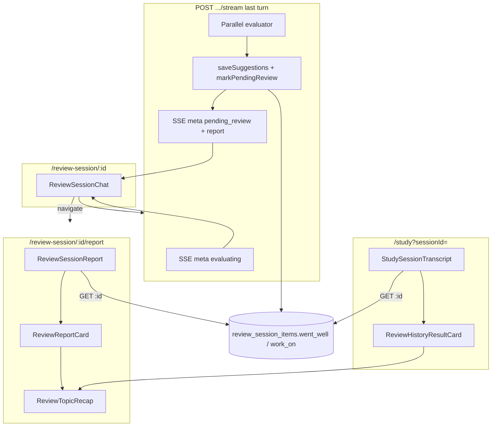
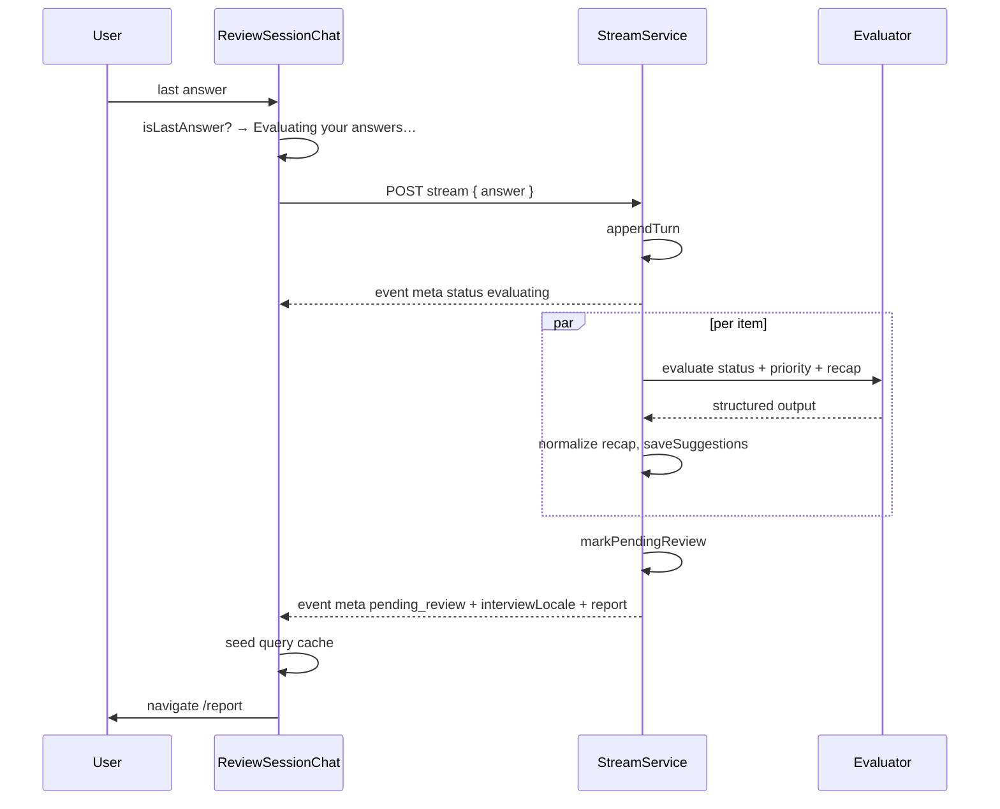

# Review Session Recap — Design

**Spec**: `.specs/features/review-session-recap/spec.md`  
**Context**: `.specs/features/review-session-recap/context.md`  
**Status**: Approved

---

## Architecture Overview

No new module. Recap is an **extension of the existing last-turn evaluation**: the same parallel `IReviewSessionEvaluator` calls gain `wentWell` / `workOn`, persist on `ReviewSessionItem`, and the three existing UIs (chat wait, `/report`, `/study?sessionId=` history) consume them.



### Last-turn sequence



---

## Design Decisions

| ID | Decision | Choice | Rationale |
|----|----------|--------|-----------|
| RSR-DES-01 | Evaluating signal | **Both:** client `isLastAnswer(progressMeta)` **and** SSE `meta: { status: "evaluating" }` as the first event on the evaluation path | Client covers latency before the first byte; SSE covers missing local progress (resume). `handleProgressMeta` must ignore non-progress metas |
| RSR-DES-02 | Recap storage | Prisma `String[]` `@default([])` — `wentWell` / `workOn`, mapped `went_well` / `work_on` | Typed arrays, not JSON objects like `turns`; empty default covers legacy rows |
| RSR-DES-03 | Recap caps | Max **4** bullets, max **180** chars each. **Clamp** after LLM parse (trim, drop empty, slice) | Verbose extra bullets must not fail the whole item (that would hide suggestion + recap). Status/priority `superRefine` still fail-closed |
| RSR-DES-04 | Missing recap fields | Zod `.default([])` on LLM schema | Omitting arrays must not mark evaluation failed |
| RSR-DES-05 | Empty sections | **Omit** the heading + list. No invented fallback sentence | Prompt forbids fabricating strengths; empty UI must not look like AI copy |
| RSR-DES-06 | Failure persist | `saveSuggestions(null)` also writes `wentWell: []`, `workOn: []` and nulls status/priority | Spec: failed item has empty recap |
| RSR-DES-07 | Locale on wire | `interviewLocale` on `GET /:id` **and** on `pending_review` SSE meta (top-level, next to `status`) | History must not use the user’s current preference; seed cache must not flash English headings |
| RSR-DES-08 | Card split | Shared `ReviewTopicRecap`; `ReviewReportCard` (edit) vs `ReviewHistoryResultCard` (read-only) | Avoid disabling editors on the apply card; Apply must not appear in history |
| RSR-DES-09 | Page copy (EN chrome) | Title **Review results**. Description: “See how the session went, then confirm what happens to your study list.” Wait: **Evaluating your answers…** | Agent discretion; hub chrome stays English (`STUDY-DEC-08`) |
| RSR-DES-10 | Recap headings | FE `getReviewRecapHeadings(locale)` = Practice headings **without** `## ` (`What went well` / `What to work on`; PT: `O que você fez bem` / `O que precisa trabalhar`) | Same meaning as `getClosingFeedbackCopy`; FE cannot import backend |
| RSR-DES-11 | Derived summary | Pure helper `deriveReviewResultsSummary(items, "suggested" \| "confirmed")` | No extra LLM. Always show three counts |
| RSR-DES-12 | Query cache seed | `seedReportCache` includes `interviewLocale`, `wentWell`, `workOn` | Prevents empty-recap flash on `/report` |
| RSR-DES-13 | Apply / auto-apply | Unchanged | `RSR-DEC-09` |
| RSR-DES-14 | Mappers | Extend the **two existing** `toReportItem` helpers (stream + sessions service). No shared-module refactor | Small additive fields; extraction is out of scope |

---

## Data Models

### Prisma (`ReviewSessionItem`)

```prisma
wentWell String[] @default([]) @map("went_well")
workOn   String[] @default([]) @map("work_on")
```

Written only in `saveSuggestions`. Not cleared on Apply. No backfill job — default `[]`.

### Domain record

```typescript
// ReviewSessionItemRecord — add:
wentWell: string[];
workOn: string[];

// ReviewSessionSuggestion — add:
wentWell: string[];
workOn: string[];
```

`saveSuggestions(id, null)` → `suggestedStatus/Priority` null, recap `[]`.

### Evaluation Zod

Keep the flat object (OpenAI structured output still rejects unions).

```typescript
const recapBulletsLlmSchema = z.array(z.string()).default([]);

export const reviewSessionEvaluationOutputSchema = z
  .object({
    status: reviewItemStatusSchema,
    priority: reviewPrioritySchema.nullable(),
    wentWell: recapBulletsLlmSchema,
    workOn: recapBulletsLlmSchema,
  })
  .superRefine(/* existing status/priority rules */);

export function normalizeReviewSessionEvaluation(
  output: ReviewSessionEvaluationOutput,
): ReviewSessionEvaluationOutput {
  return {
    ...output,
    wentWell: clampRecapBullets(output.wentWell),
    workOn: clampRecapBullets(output.workOn),
  };
}

function clampRecapBullets(values: string[]): string[] {
  return values
    .map((value) => value.trim().slice(0, 180))
    .filter((value) => value.length > 0)
    .slice(0, 4);
}
```

`createReviewSessionEvaluationNode` returns `normalizeReviewSessionEvaluation(schema.parse(raw))`.

### API shapes

**`GET /api/review-sessions/:id`** and **apply 200** (same mapper):

```typescript
type ReviewSessionReport = {
  id: string;
  status: ReviewSessionStatus;
  interviewLocale: InterviewLocale;
  items: Array<{
    // existing fields
    wentWell: string[];
    workOn: string[];
  }>;
};
```

List summaries and create 201: **unchanged** (no recap).

**SSE**

| Event | When | Payload |
|-------|------|---------|
| `meta` | Start of `runEvaluation`, after `writeHead` | `{ "status": "evaluating" }` |
| `error` | Per-item eval failure (existing) | `{ message, reviewSessionItemId }` |
| `meta` | After persist + `markPendingReview` | `{ status: "pending_review", interviewLocale, report: [...] }` |

Each `report[]` row adds `wentWell`, `workOn` (empty on failure). Failed items still appear (status/priority null, empty recap) — same as today.

### Frontend types (`src/types/review-sessions.ts`)

- `ReviewSession.interviewLocale`
- `ReviewSessionItemReport.wentWell` / `workOn`
- `ReviewSessionStreamMetaEvaluating = { status: "evaluating" }`
- `ReviewSessionStreamMetaComplete` += `interviewLocale` + recap on `report[]`
- Union: progress \| evaluating \| complete

---

## Prompt

Extend `buildReviewSessionEvaluationPrompt` **Instructions** (status/priority rules unchanged):

- Also fill `wentWell` (0–4 short bullets of genuine demonstrated strengths for this angle) and `workOn` (0–4 actionable gaps from this item’s Q&A).
- Empty array when there is no genuine strength / nothing substantial to improve — **never invent**.
- Bullets: one sentence, no markdown, grounded in the turns above.
- Field names stay English; **content** follows the existing locale block (already last section).

Prompt unit tests: assert recap instructions + “never invent”; locale block still last.

---

## Backend components

### `ReviewSessionRepository.saveSuggestions`

- **Location**: `backend/src/modules/review-sessions/repository/review-session-repository.ts`
- Persist recap arrays; map `String[]` on read (Prisma already returns `string[]`).
- Integration test: success writes bullets; `null` clears to `[]`.

### `ReviewSessionStreamService.runEvaluation`

- **Location**: `backend/src/modules/review-sessions/service/review-session-stream-service.ts`
- After headers: `writeEvent(res, "meta", { status: "evaluating" })` then abort-check.
- `toSuggestion` includes clamped recap.
- `toReportItem` includes recap arrays.
- Final meta includes `interviewLocale` from the stream body (same value passed to `markPendingReview`).

### `ReviewSessionsService.toReport`

- **Location**: `backend/src/modules/review-sessions/service/review-sessions-service.ts`
- Add `interviewLocale` + recap on items.
- Unit tests on `getById` / apply response.

### `createReviewSessionEvaluationNode`

- Unchanged invoke pattern; parse + **normalize**.
- Update fixtures to include recap (or rely on `.default([])`).

### Docs

- `backend/docs/frontend-mock-interview-api.md` — evaluating meta, report recap, GET `interviewLocale`.

---

## Frontend components

### `isLastReviewAnswer` + evaluating UI

- **Location**: `frontend/src/features/study/lib/is-last-review-answer.ts`  
  `itemIndex === totalItems - 1 && turnsCompleted + 1 === questionsPerItem`
- **`ReviewSessionChat`**: on `sendTurn(answer)` if last → `isEvaluating = true`. On `meta.status === "evaluating"` → same. On `pending_review` → seed cache (incl. recap + locale) → `router.push(.../report)` **without** swapping copy to “Redirecting…”. Keep evaluating until unmount.
- `canSend` false while evaluating.
- Message list: if evaluating, **do not** show typing/streaming AI bubble. Status: `Loader2` + “Evaluating your answers…” (`role="status"`).
- `onMeta` progress: only if `status === "in_progress"` (type guard). Evaluating must not call `handleProgressMeta`.
- Non-last answers: unchanged.

### `getReviewRecapHeadings`

- **Location**: `frontend/src/features/study/lib/review-recap-copy.ts`
- Input: `InterviewLocale`. Output: `{ wentWell: string; workOn: string }` without markdown hashes.
- Must stay in sync with backend `CLOSING_FEEDBACK_COPY` headings (strip `## `).

### `deriveReviewResultsSummary`

- **Location**: `frontend/src/features/study/lib/derive-review-results-summary.ts`

```typescript
type ReviewResultsSummary = {
  topicCount: number;
  learnedCount: number;
  priorityChangeCount: number;
};

function deriveReviewResultsSummary(
  items: ReviewSessionItemReport[],
  source: "suggested" | "confirmed",
): ReviewResultsSummary;
```

- `learnedCount`: status `learned` from the chosen source (`null` → not learned).
- `priorityChangeCount`: source status is `active` **and** source priority is non-null **and** ≠ `currentPriority`.
- Copy (EN): `{n} topics reviewed · {n} suggested as learned · {n} priority changes` on report (`suggested`); history uses `marked as learned` instead of `suggested as learned` (`confirmed`).

### `ReviewTopicRecap`

- **Purpose**: Render recap sections; omit a section when its array is empty.
- **Location**: `frontend/src/features/study/review-topic-recap.tsx`
- **Props**: `locale`, `wentWell`, `workOn`, `evaluationFailed`
- If `evaluationFailed`: render nothing (parent shows the existing warning).
- Headings from `getReviewRecapHeadings(locale)`.
- Bullets as `<ul>`; do not markdown-render.

### `ReviewReportCard`

- Recap **above** existing suggestion line + outcome controls.
- `ReportCardState` gains `wentWell` / `workOn` (read-only; not in Apply payload).

### `ReviewSessionReport`

- Header: RSR-DES-09 + derived summary (`suggested`).
- Pass `session.interviewLocale` into cards.
- Apply / keepalive **unchanged**.

### `ReviewHistoryResultCard`

- **Location**: `frontend/src/features/study/review-history-result-card.tsx`
- Topic, `ReviewTopicRecap`, read-only applied outcome (`confirmedStatus` / `confirmedPriority` + badge). No editors, no Apply.
- If `confirmedStatus` is null (should not happen on `completed`): omit outcome line.

### `StudySessionTranscript`

- Title: **Session results** (page chrome EN).
- Order: derived summary (`confirmed`) → result cards → existing **Session transcript** heading + Q&A.
- Legacy empty recap: cards still show applied outcome; recap sections omitted; transcript unchanged.
- `pending_review` redirect in `StudyHubShell` unchanged.

---

## Code Reuse Analysis

| Piece | Location | Use |
|-------|----------|-----|
| Parallel eval + SSE | `review-session-stream-service.ts` | Add evaluating meta + recap persist |
| Structured eval node | `review-session-evaluation-node.ts` | Same `{prompt}` trick; parse + normalize |
| Evaluation prompt | `review-session-evaluation-prompt.ts` | Append recap instructions |
| GET mapper | `review-sessions-service.ts` `toReport` | locale + recap |
| Report cards / Apply | `review-session-report.tsx`, `build-apply-payload.ts` | Recast header/card; payload untouched |
| History panel | `study-session-transcript.tsx` | Prepend results block |
| Closing heading meaning | `getClosingFeedbackCopy` | Mirror on FE without `## ` |
| Priority badge | `review-priority-badge.tsx` | History applied outcome |
| `readSseStream` | `sse-stream.ts` | Additive meta; no parser change |

### CONCERNS.md

| Concern | Mitigation |
|---------|------------|
| Fragile SSE parser | New `status` values are extra `meta` events, same `event: meta` + JSON. FE **must** discriminate `evaluating` vs `in_progress` vs `pending_review` before reading progress fields |
| No FE test runner | Do **not** add `*.test.ts` on frontend (tsc + vitest mismatch). Gates: lint + check-types + build. Logic covered on backend unit/integration/e2e |
| Auth still client-only | Unchanged; ownership stays on GET/stream |

---

## Error Handling Strategy

| Scenario | Handling | User impact |
|----------|----------|-------------|
| Last answer, eval in flight | Evaluating wait; composer disabled | Understands the session ended |
| Per-item eval throw | Existing SSE `error` + empty recap + null suggestion | Warning on that card; others recap normally |
| Recap over cap / messy strings | Clamp (RSR-DES-03) | Suggestion still applies |
| Missing recap keys | Default `[]` | Card without those sections |
| Invalid status/priority | Existing parse fail → item failure | Warning, no bullets |
| Abort during eval | Existing: no `pending_review`; session `in_progress` | Resume Q&A; evaluating state gone on remount |
| GET without new fields (old server) | N/A — ship BE first | Tasks: BE before FE report/history |
| History locale missing | Fallback `en` headings only if `interviewLocale` absent (should not after GET change) | Document as defensive |

---

## File layout (delta)

```
backend/
  prisma/schema/ai-mock-interview.prisma     # + String[] columns
  src/modules/review-sessions/
    validations/review-session-schemas.ts    # + recap + normalize
    prompts/review-session-evaluation-prompt.ts
    repository/review-session-repository.ts
    types/review-session-record.ts
    service/review-session-stream-service.ts
    service/review-sessions-service.ts
  docs/frontend-mock-interview-api.md

frontend/src/
  types/review-sessions.ts
  features/study/
    lib/is-last-review-answer.ts             # NEW
    lib/review-recap-copy.ts                 # NEW
    lib/derive-review-results-summary.ts     # NEW
    lib/report-card-state.ts
    review-topic-recap.tsx                   # NEW
    review-report-card.tsx
    review-history-result-card.tsx           # NEW
    review-session-report.tsx
    review-session-chat.tsx
    study-session-transcript.tsx
```

---

## Testing Strategy

### Backend (required)

| Layer | What |
|-------|------|
| Unit schema | Default `[]`; clamp 5→4 and 181→180 chars; status/priority rules unchanged |
| Unit prompt | Recap instructions + never invent; locale block last |
| Unit node | Parse + normalize; malformed status still throws |
| Unit stream | First write on eval path is `evaluating`; final meta has locale + recap |
| Unit getById | `interviewLocale` + `wentWell`/`workOn` |
| Integration repository | `saveSuggestions` success and null |
| E2E | Mocked eval returns recap; GET after last turn includes bullets; failure item empty arrays |

Gates: existing backend lint / types / unit / integration / e2e for the review-sessions suite.

### Frontend

| Gate | Command |
|------|---------|
| Quick | `bun run lint && bun run check-types` |
| Build | `bun run lint && bun run check-types && bun run build` |

No new Vitest files.

**Manual UAT**

1. 1-topic session: last submit → evaluating (not typing) → report with recap then controls → Apply.
2. 2-topic session: derived counts; one suggested learned; recap per card.
3. PT session: bullets + recap headings in PT; Apply still EN.
4. `/study` history: results above transcript; no Apply; EN chrome.
5. Legacy completed session (empty arrays): outcome + transcript, no empty headings.
6. Leave report without Apply: keepalive still applies (unchanged).

---

## Requirement Traceability (design coverage)

| Requirement | Design |
|-------------|--------|
| RSR-01, RSR-02 | RSR-DES-01, `ReviewSessionChat` evaluating UI |
| RSR-03, RSR-04 | RSR-DES-09, RSR-DES-11, report header |
| RSR-05, RSR-06 | `ReviewTopicRecap`, RSR-DES-05, RSR-DES-08 |
| RSR-07 | RSR-DES-13 |
| RSR-08–RSR-11 | Prisma, normalize, `saveSuggestions`, GET + SSE |
| RSR-12–RSR-14 | History cards + `interviewLocale` |

---

## Out of Scope (unchanged)

Per-question feedback, session-level closing LLM, new route, chat closing bubble, Apply contract, question generation, app-wide i18n, recap backfill, editing recap text.

---

## Implementation order (for Tasks)

1. Prisma + record + `saveSuggestions`  
2. Schema normalize + prompt + evaluation node  
3. Stream evaluating meta + report payload + GET `interviewLocale` + API doc + tests  
4. FE types  
5. Chat evaluating wait + cache seed  
6. Report recast (recap + summary)  
7. History results block  

BE 1–3 before FE 5–7.

---

## Next Steps

1. **Review and approve** this design — especially RSR-DES-01 (evaluating meta), RSR-DES-03 (clamp vs fail-parse), RSR-DES-08 (card split). **Approved 2026-08-29.**
2. **Tasks** (`tasks.md`) — atomic BE then FE with gates.
3. **Execute** per task; UAT the 1- and 2-topic paths plus history.
