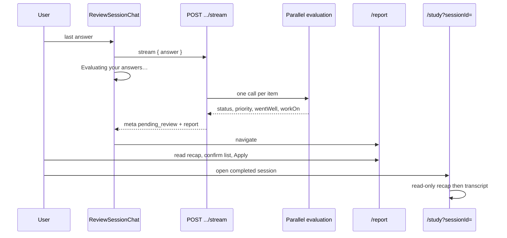

# Review Session Recap — Specification

## Problem Statement

Candidates finish a Review Session expecting **feedback on how they did**. Today the last answer produces no pedagogical close: the stream looks like another question is coming, then the UI jumps to **“Review suggestions”** — a form to change priority / mark learned. Evaluation only stores `{ suggestedStatus, suggestedPriority }`, with no rationale. Completed history on `/study` is transcript-only, so the session never has a durable “how it went.”

## Goals

- [ ] After the last review answer, the candidate sees an **evaluating** wait on the chat, then a **results** page that leads with per-topic recap and then list confirmation
- [ ] Recap is **Went well / Work on bullets per topic**, in the session locale, from the **same** parallel evaluation (no second LLM)
- [ ] Recap is **persisted** and shown **above the transcript** when opening a completed session from `/study` history
- [ ] Bulk Apply and auto-apply-on-leave stay unchanged; Q&A stays question-only

## Out of Scope

| Item | Reason |
|------|--------|
| Feedback after each question | Grill: recap only at the end |
| Session-level closing LLM (Practice-style overall paragraph) | Grill: per-topic only; header is UI-derived |
| New report route or two-step wizard | Grill: same `/report` page |
| Closing bubble in the Q&A chat | Grill: recap lives on results + history |
| Changing Apply / auto-apply / merge rules | Study Hub (`STUDY-DEC-03`, `STUDY-DEC-04`) |
| Changing question generation | Unrelated |
| App-wide i18n of Study chrome | `STUDY-DEC-08`; only recap headings + bullets follow session locale |
| Backfill recap for sessions evaluated before this feature | Empty arrays; UI omits empty recap sections |
| Editing recap text | Recap is evaluation output, read-only |

---

## Relationship to Existing Features

| Feature / code | Relevance |
|----------------|-----------|
| [study-hub-review-sessions](../../../frontend/.specs/features/study-hub-review-sessions/spec.md) | Owns Q&A → report → Apply; this feature recasts the report and last-turn wait |
| [study-session-history](../../../frontend/.specs/features/study-session-history/spec.md) | **Overturns** “transcript-only / no outcomes” for completed sessions: results block above transcript |
| [review-items-learned-status](../../../backend/.specs/features/review-items-learned-status/spec.md) | Evaluation still suggestion-only until Apply; extend output + persistence |
| Practice closing | Heading meaning via `getClosingFeedbackCopy` (`en` / `pt`); **not** the long markdown template |
| `ReviewSessionChat` | Last-answer wait + navigate on `pending_review` |
| `ReviewSessionReport` / `ReviewReportCard` | Recap-first cards + existing editors |
| `StudySessionTranscript` | Results (read-only) then Q&A |
| `POST .../stream` last turn | Already runs `runEvaluation` with no tokens; must not look like the next question |

---

## Decisions (resolved in discussion)

| ID | Decision |
|----|----------|
| RSR-DEC-01 | Recap on the **same** `/report` page as list confirmation (recap first, then controls) |
| RSR-DEC-02 | **Per-topic** Went well / Work on bullets; session header is **derived counts** only |
| RSR-DEC-03 | Bullets come from the **existing** parallel evaluation (extend schema). No second LLM |
| RSR-DEC-04 | Q&A stays question-only; recap **only after** the last answer |
| RSR-DEC-05 | Last answer: stay on chat with **Evaluating your answers…**, then go to report |
| RSR-DEC-06 | Persist recap; completed history shows **results then transcript** |
| RSR-DEC-07 | Recap headings + bullets follow **session** `interviewLocale` |
| RSR-DEC-08 | Evaluation failure: warning, no bullets, controls still editable (current behavior) |
| RSR-DEC-09 | Apply + auto-apply-on-leave **unchanged** |

---

## User Stories

### P1: Evaluating wait on the last answer ⭐ MVP

**User Story**: As a candidate who just submitted the last review answer, I want a clear “we are evaluating” state instead of a typing indicator or a silent redirect, so I understand the session ended.

**Why P1**: The current last-turn UX is the jump the tester reported.

**Acceptance Criteria**:

1. WHEN the candidate submits the last answer of the last topic THEN the Q&A composer SHALL stop accepting answers and the UI SHALL show **Evaluating your answers…** (not a typing/next-question bubble, not “Redirecting…”).
2. WHEN evaluation is still running THEN the UI SHALL remain on `/review-session/[sessionId]` with that wait state.
3. WHEN SSE `meta.status` is `"pending_review"` THEN the UI SHALL navigate to `/review-session/[sessionId]/report`.
4. WHEN the candidate resumes an `in_progress` session that is not on the last answer THEN the evaluating copy SHALL NOT appear.

**Independent Test**: Complete a 1-topic session; after the last submit, observe evaluating copy, then land on report.

**Requirements**: RSR-01, RSR-02

---

### P1: Results page — recap then list confirmation ⭐ MVP

**User Story**: As a candidate who finished review questions, I want to read how I did on each topic and then confirm what happens to my study list, so the priority screen is a consequence of the recap, not a surprise.

**Why P1**: Direct fix for “no final feedback / jumped to priority.”

**Acceptance Criteria**:

1. WHEN `/review-session/[sessionId]/report` loads for `pending_review` THEN the page SHALL be framed as **session results** (not “Review suggestions” as the primary title).
2. WHEN the page loads THEN it SHALL show a **derived** session summary (no extra LLM), including at least: number of topics reviewed, count suggested `learned`, count with a suggested priority **change** vs `currentPriority`.
3. WHEN a topic’s evaluation succeeded THEN its card SHALL show, above the outcome controls: recap headings in the session locale, `wentWell` bullets, `workOn` bullets, then Keep active / Mark as learned / priority (existing controls).
4. WHEN `wentWell` or `workOn` is an empty array THEN that section SHALL be omitted or replaced with a non-invented fallback sentence (Design); the model SHALL NOT be prompted to fabricate a strength.
5. WHEN `suggestedStatus` is `null` (evaluation failed) THEN the card SHALL show the existing evaluation-unavailable warning, **no** recap bullets, and remain fully editable.
6. WHEN the user clicks **Apply** THEN behavior SHALL match Study Hub: bulk `POST .../apply`, invalidate queries, toast, `/study`.
7. WHEN the user leaves without Apply THEN auto-apply-on-leave SHALL still run with the **current edited** card state (`STUDY-DEC-04`).

**Independent Test**: Finish Q&A → report shows recap bullets then controls; edit one priority → Apply → Active list updates.

**Requirements**: RSR-03, RSR-04, RSR-05, RSR-06, RSR-07

---

### P1: Evaluation persists recap with suggestions ⭐ MVP

**User Story**: As the system, I want the existing per-item evaluation to return recap bullets alongside status/priority, so the UI does not invent feedback and history can replay it.

**Why P1**: Without persistence, recap dies after Apply and cannot appear in history.

**Acceptance Criteria**:

1. WHEN all items reach N answered turns THEN the backend SHALL still evaluate items **in parallel** with one call per item (no additional session-level call).
2. WHEN evaluation succeeds THEN the backend SHALL persist `suggestedStatus`, `suggestedPriority`, **`wentWell`**, and **`workOn`** on that `ReviewSessionItem`.
3. WHEN evaluation fails THEN `suggestedStatus` / `suggestedPriority` stay `null` and recap arrays SHALL be empty (or null — Design); SSE may still emit per-item `error` as today.
4. WHEN SSE emits `pending_review` `report[]` THEN each item SHALL include `wentWell` and `workOn` (empty on failure).
5. WHEN `GET /api/review-sessions/:id` returns THEN each item SHALL include `wentWell` and `workOn`, and the payload SHALL include **`interviewLocale`** so the client can render recap headings.
6. WHEN structured output is invalid (status/priority rules today **or** recap not arrays of strings) THEN that item SHALL be treated as evaluation failure.

**Independent Test**: Complete a session; `GET :id` shows bullets matching the evaluation; `review_items` still unchanged until Apply.

**Requirements**: RSR-08, RSR-09, RSR-10, RSR-11

---

### P1: Completed history shows results then transcript ⭐ MVP

**User Story**: As a candidate opening a past review from `/study`, I want to see how that session went and then the Q&A, so the recap is not a one-shot that vanishes after Apply.

**Why P1**: Grill choice; overturns history transcript-only MVP for this surface.

**Acceptance Criteria**:

1. WHEN the user opens a `completed` session via `/study?sessionId=` THEN the main panel SHALL show a **read-only results** block **above** the existing Q&A transcript (no Results / Transcript tabs).
2. WHEN a results card is shown THEN it SHALL include topic, recap bullets (same empty/failure rules as report), and the **applied** outcome (`confirmedStatus` / `confirmedPriority`), not editors and not Apply.
3. WHEN recap arrays are empty (legacy sessions) THEN the recap sections SHALL be omitted; the transcript SHALL still render.
4. WHEN recap headings are shown THEN they SHALL follow that session’s `interviewLocale`, not the user’s current preference if it differs.
5. WHEN the session is `pending_review` opened from history/banner THEN the app SHALL keep redirecting to the **editable** report (unchanged).

**Independent Test**: Apply a session with recap → `/study` sidebar → open session → results then transcript; no Apply button.

**Requirements**: RSR-12, RSR-13, RSR-14

---

## Edge Cases

- WHEN the session has exactly one item THEN derived summary and recap SHALL still render (no special skip).
- WHEN evaluation succeeds but both bullet arrays are empty THEN do not treat as evaluation failure; omit empty sections.
- WHEN locale is `pt` THEN bullets and recap headings SHALL be Portuguese; Apply / “Evaluating your answers…” chrome MAY stay English in this iteration (`STUDY-DEC-08` for hub chrome; evaluating string: Design may keep English).
- WHEN the last SSE connection drops during evaluation THEN session remains `in_progress` until evaluation persists (existing abort rules); resume SHALL continue Q&A or wait — if evaluation later completed, `GET` `pending_review` redirects to report (existing 409/status redirects).
- WHEN `wentWell`/`workOn` exceed schema caps THEN the backend SHALL fail that item’s parse (evaluation failure) or truncate in Design — **must be consistent**; prefer fail-parse to silent truncate unless Design documents truncation.
- WHEN seed report cache from SSE meta on the client THEN cache SHALL include recap fields so the report does not flash empty bullets.

---

## API & data (contract)

### Persistence (`ReviewSessionItem`)

New columns (JSON arrays of strings), default `[]`:

- `wentWell` (`went_well`)
- `workOn` (`work_on`)

Written only in `saveSuggestions` together with status/priority. Not user-editable. Not cleared on Apply.

### Evaluation structured output (extend)

```ts
{
  status: "active" | "learned",
  priority: "low" | "medium" | "high" | null, // same rules as today
  wentWell: string[], // 0–4 bullets
  workOn: string[],   // 0–4 bullets
}
```

Caps and max character length: Design. Prompt: sufficient demonstration rules unchanged; never invent a strength; recap must cite the Q&A; locale block already on the prompt.

### `GET /api/review-sessions/:id`

Add:

- `interviewLocale`: `"en"` | `"pt"`
- per item: `wentWell: string[]`, `workOn: string[]`

### SSE `meta` `pending_review.report[]`

Same recap arrays per item.

### Apply

Unchanged body. Recap is not part of apply.

---

## Architecture Overview



---

## Requirement Traceability

| Requirement ID | Story | Phase | Status |
|----------------|-------|-------|--------|
| RSR-01 | P1: Evaluating wait | Validate | ✅ Verified (code + types/build; interactive UAT pending) |
| RSR-02 | P1: Evaluating wait | Validate | ✅ Verified (code + types/build; interactive UAT pending) |
| RSR-03 | P1: Results page | Validate | ✅ Verified (code + types/build; interactive UAT pending) |
| RSR-04 | P1: Results page | Validate | ✅ Verified (code + types/build; interactive UAT pending) |
| RSR-05 | P1: Results page | Validate | ✅ Verified (code + types/build; interactive UAT pending) |
| RSR-06 | P1: Results page | Validate | ✅ Verified (code + types/build; interactive UAT pending) |
| RSR-07 | P1: Results page | Validate | ✅ Verified (code + types/build; E2E apply; interactive UAT pending) |
| RSR-08 | P1: Persist recap | Validate | ✅ Verified |
| RSR-09 | P1: Persist recap | Validate | ✅ Verified |
| RSR-10 | P1: Persist recap | Validate | ✅ Verified |
| RSR-11 | P1: Persist recap | Validate | ✅ Verified |
| RSR-12 | P1: History | Validate | ✅ Verified (code + types/build; interactive UAT pending) |
| RSR-13 | P1: History | Validate | ✅ Verified (code + types/build; interactive UAT pending) |
| RSR-14 | P1: History | Validate | ✅ Verified (GET locale + FE headings; interactive UAT pending) |

**Coverage:** 14 total, 14 mapped to tasks (T1–T18), 0 unmapped. Validated 2026-08-29.

---

## Success Criteria

- [ ] After the last review answer, the candidate never lands on a priority form without a recap (or an explicit evaluation-failed warning)
- [ ] Last-turn wait is recognizably evaluation, not the next question
- [x] Recap bullets are stored (unit/integration/E2E); history UI above transcript implemented — live replay UAT pending
- [x] Apply / auto-apply / `review_items` mutation timing unchanged (E2E apply 200; apply body has no recap)
- [x] No extra LLM round-trip after parallel evaluation (same `Promise.allSettled` evaluator path)
- [x] No regression to Practice closing or live Q&A question generation (closing-feedback + stream suites still green)

---

## TLC Scope Assessment

**Size:** **Large** — backend schema + evaluation contract, three frontend surfaces (chat wait, report, history), overturns history “transcript-only” for outcomes.

**Next phases after spec approval:**

1. **Design** — Prisma/JSON shape, Zod caps, evaluating meta vs client inference, report/history card split, `interviewLocale` on GET, API doc
2. **Tasks** — BE persist/eval/API → FE types → chat wait → report recast → history results
3. **Execute** — per task; interactive UAT of 1-topic and 2-topic sessions plus history open

---

**Next step:** Interactive UAT (1-topic + 2-topic + history). Apply local Prisma migration `20260829120000_add_review_session_item_recap` first. Commits deferred until asked.

---