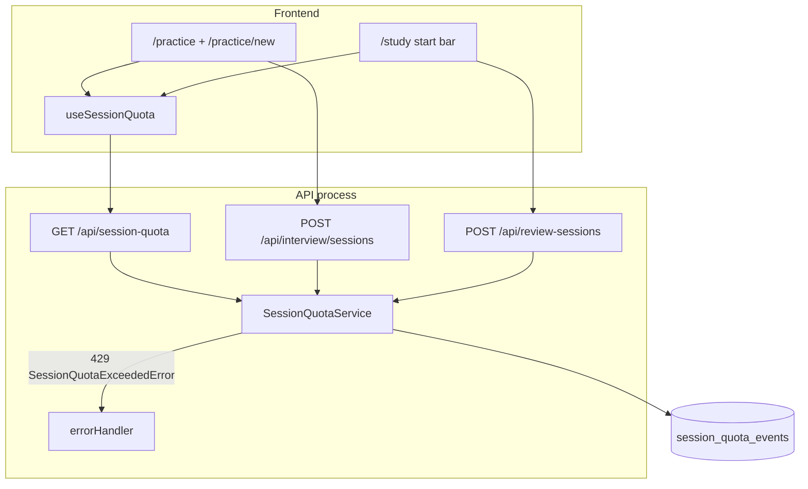
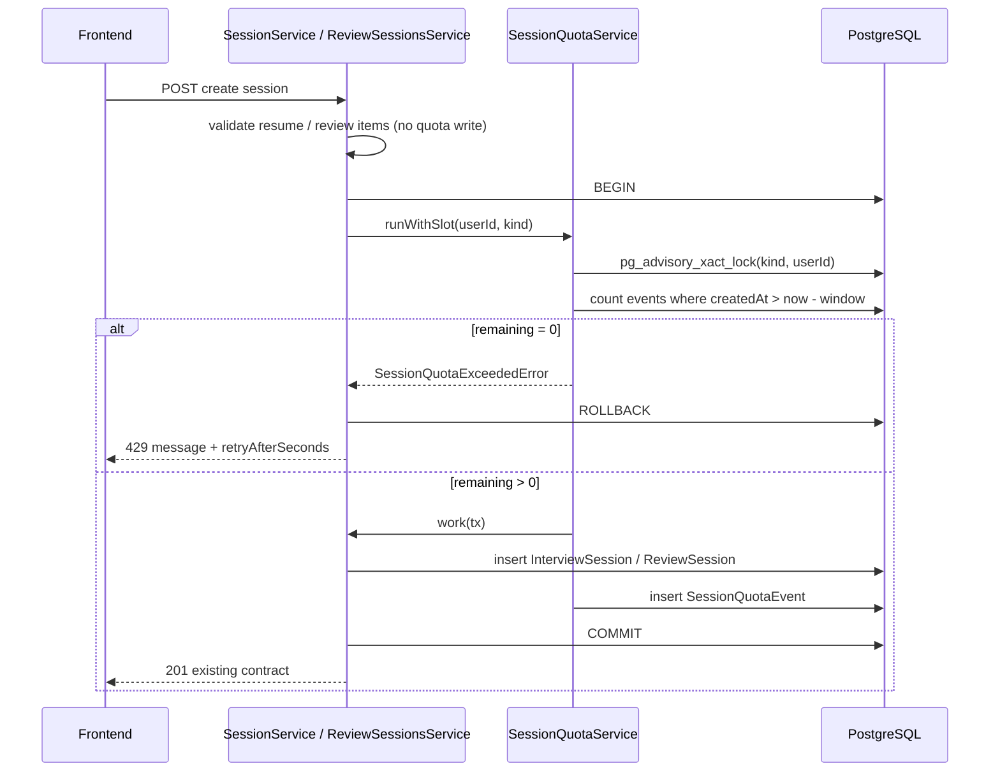

# Session Create Quota — Design

**Spec**: `.specs/features/session-create-quota/spec.md`  
**Status**: Implemented

---

## Architecture Overview

A new `session-quota` module owns the sliding-log. Practice and Study **creates** call it inside a Postgres transaction (advisory lock → count in-window events → create session → insert log row). A dedicated `GET /api/session-quota` returns both buckets for the start UI. `aiRateLimiter` and token limits are untouched. **No worker/cron:** expired rows stay in the table; queries ignore them.





---

## Code Reuse Analysis

### Existing Components to Leverage

| Component | Location | How to Use |
| --------- | -------- | ---------- |
| Module route discovery | `backend/src/config/routes.ts` | New `modules/session-quota/routes/` mounts at `/api/session-quota` |
| `TokenUsageService` + factory | `modules/token-usage/`, `factories/token-usage/` | Same module layout: repository + service + factory from `env` |
| `TokenLimitExceededError` / `HttpError` | `shared/errors/http-errors.ts` | New `SessionQuotaExceededError` (429) beside it |
| `errorHandler` | `shared/middlewares/error-handler-middleware.ts` | Extra JSON fields + `Retry-After` when error has `retryAfterSeconds` |
| `SessionService.createSession` | `modules/interview/service/session-service.ts` | Validate resume first; wrap persist in quota `runWithSlot(..., "practice")` |
| `ReviewSessionsService.create` | `modules/review-sessions/service/review-sessions-service.ts` | Validate items first; wrap persist in `runWithSlot(..., "study")` |
| Prisma `User` | `prisma/schema/user.prisma` | Add `sessionQuotaEvents` relation (mirror `tokenUsage`) |
| `checkAuth` (global) | `config/app.ts` | GET/create already authenticated; `req.userId` set |
| TanStack `useQuery` + `queryKeys` | `frontend/src/lib/query/` | `useSessionQuota` like `useSessions` |
| `apiRequest` / `ApiError.body` | `frontend/src/lib/api/client.ts` | GET + 429 body already exposed on `ApiError` |
| E2E env override pattern | `interview.e2e.test.ts` AI rate-limit describe | Dedicated quota describe with `SESSION_QUOTA_*_MAX=3` + dynamic `createApp` |
| `vitest.e2e.setup.ts` | high `RATE_LIMIT_*` | Same: force quota max **500** so existing suites keep creating sessions |

### Integration Points

| System | Integration Method |
| ------ | ------------------ |
| PostgreSQL | New table `session_quota_events`; no FK to session rows (delete must not cascade) |
| Interview create | `SessionService` + `SessionRepository.create(tx)` |
| Review-session create | `ReviewSessionsService` + `ReviewSessionRepository.create(..., tx)` |
| Express errors | `errorHandler` JSON `{ message, retryAfterSeconds }` + header |
| Frontend start | `/practice`, `/practice/new`, `StudySelectionBar` |

### CONCERNS.md

Frontend CONCERNS (auth-in-localStorage, no route middleware) do not change this design: quota is enforced on the API; UI is advisory. Backend remains source of truth on create 429.

---

## Components

### `SessionQuotaEvent` (Prisma)

- **Purpose**: Append-only sliding-log row; one per successful create.
- **Location**: `backend/prisma/schema/user.prisma` (next to `UserTokenUsage`)
- **Interfaces**: table only
- **Dependencies**: `User` (`onDelete: Cascade` on **user** delete, not session delete)
- **Reuses**: `UserTokenUsage` mapping style (`@@map`, Int `userId`)

No `sessionId`. Linking to a session would invite `ON DELETE CASCADE` and refund on interview delete (SCQ-08).

### `SessionQuotaRepository`

- **Purpose**: Count / list in-window events and insert.
- **Location**: `backend/src/modules/session-quota/repository/session-quota-repository.ts`
- **Interfaces**:
  - `listInWindow(tx, userId, kind, windowStart: Date): Promise<SessionQuotaEvent[]>` — `createdAt > windowStart`, oldest first
  - `insert(tx, userId, kind): Promise<void>`
  - `lockBucket(tx, userId, kind): Promise<void>` — `SELECT pg_advisory_xact_lock($kindCode, $userId)`
- **Dependencies**: Prisma client / `TransactionClient`
- **Reuses**: `TokenUsageRepository` injection style (`tx` passed in, like we will do for session creates)

`kindCode`: `practice = 1`, `study = 2`. First advisory locks in this codebase; two-int form isolates buckets so practice and study creates can run concurrently for the same user.

### `SessionQuotaService`

- **Purpose**: Sliding-log math, consume-on-create, read snapshot.
- **Location**: `backend/src/modules/session-quota/service/session-quota-service.ts`
- **Interfaces**:
  - `getSnapshot(userId): Promise<{ practice: QuotaBucket; study: QuotaBucket }>`
  - `runWithSlot<T>(userId, kind, work: (tx) => Promise<T>): Promise<T>`
- **Dependencies**: repository, `SessionQuotaServiceConfig` `{ practiceMax, studyMax, windowMs }`
- **Reuses**: `TokenUsageService` config-from-env factory

**`runWithSlot` algorithm** (SCQ-02/03/14):

1. `prisma.$transaction(async (tx) => { ... })`
2. `lockBucket`
3. `listInWindow` with `windowStart = now - windowMs`
4. If `events.length >= max` → throw `SessionQuotaExceededError` (compute `retryAfterSeconds` from oldest event; **no insert**)
5. `const result = await work(tx)`
6. `insert` event
7. return `result`

Validate resume / review items **before** `runWithSlot` so 404/400 do not take a lock or write an event.

**Snapshot** (shared by GET and error path):

- `used = in-window count`
- `limit = max for kind`
- `remaining = max(0, limit - used)`
- `retryAfterSeconds`: `null` if `remaining > 0`; else `max(1, ceil((oldest.createdAt + windowMs - now) / 1000))`

Inclusive rule: count `createdAt > now - windowMs`. At exact window age the slot is free (SCQ-05/13).

### `SessionQuotaExceededError`

- **Purpose**: 429 distinct from AI limiter and token cap.
- **Location**: `shared/errors/http-errors.ts`, re-export `shared/index.ts`
- **Interfaces**: `new SessionQuotaExceededError({ retryAfterSeconds, quota: "practice" | "study" })`
- **Message** (English, distinct):
  - practice: `"Practice session limit reached. You can start another after the waiting period."`
  - study: `"Study session limit reached. You can start another after the waiting period."`
- **Fields**: `statusCode = 429`, `retryAfterSeconds: number`, `quota: "practice" | "study"`

### `errorHandler` extension

- **Purpose**: Emit machine-readable retry for this error only.
- **Location**: `error-handler-middleware.ts`
- **Behavior**: If the mapped `HttpError` has numeric `retryAfterSeconds`:
  - `res.setHeader("Retry-After", String(retryAfterSeconds))`
  - JSON `{ message, retryAfterSeconds }` (quota field optional extra; spec requires at least these two)
- **Else**: keep `{ message }` (token 429 and everything else unchanged)

Duck-type the field so a second module instance of the class still works (same `instanceof` pitfall already documented in this middleware).

### `GET /api/session-quota`

- **Purpose**: Read both buckets; no writes.
- **Location**: `modules/session-quota/routes/session-quota-routes.ts` → `/api/session-quota` (discovery: folder name `session-quota`)
- **Interfaces**: `GET /` → 200 body per spec; 401 via global `checkAuth`
- **Dependencies**: `makeSessionQuotaController` → service `getSnapshot`
- **Reuses**: `users-routes.ts` GET style (`asyncHandler`, no extra limiter)

Do **not** apply `aiRateLimiter` here.

### Interview / review create wiring

- **Purpose**: Consume quota only on successful persist.
- **Location**: `session-service.ts`, `review-sessions-service.ts`, both repositories’ `create`, both factories
- **Interfaces**: `create(..., db: Prisma.TransactionClient | PrismaClient = prisma)` so the session row is in the **same** transaction as the log row. Default `prisma` keeps other callers unchanged.
- **Dependencies**: inject `SessionQuotaService`
- **Reuses**: existing validation order (resume ready / review items found)

`deleteSession` stays as-is (hard delete). No quota call (SCQ-08).

### Frontend

- **Purpose**: Remaining + countdown on start; English; numbers from API.
- **Location**:
  - `frontend/src/types/session-quota.ts`
  - `frontend/src/lib/api/session-quota.ts`
  - `frontend/src/lib/query/keys.ts` — `sessionQuota: ["session-quota"]`
  - `frontend/src/lib/query/hooks/use-session-quota.ts`
  - `frontend/src/features/session-quota/format-retry-after.ts` — `"1h 20m"` / `"12m"`
  - `frontend/src/features/session-quota/session-quota-hint.tsx` — remaining line or disabled countdown
  - Wire: `practice/page.tsx`, `practice/new/page.tsx`, `study-selection-bar.tsx` (+ hub passes study bucket)
- **Interfaces**: `useSessionQuota()` → `{ practice, study } | undefined`; `isError` → do **not** disable Start (spec: fail open, rely on create 429)
- **Local countdown**: `retryAfterSeconds - elapsedSinceFetched`; when `<= 0`, refetch GET. Tick every 60s (no 1s timer).
- **429 race**: existing toast of `ApiError.message`; `invalidateQueries(sessionQuota)`
- **Successful create**: invalidate `sessionQuota` (and existing session lists)
- **Copy**: `"2 of 3 sessions remaining"` / `"Next session in 1h 20m"` — `limit` from API, never hardcoded 3 or “4 hours”
- **Reuses**: `useSessions` auth/`enabled` pattern; `StudySelectionBar` `disabled` already exists — also disable when study `remaining === 0`

GET failure: hint hidden or generic; Start remains enabled.

---

## Data Models

### `SessionQuotaKind`

```prisma
enum SessionQuotaKind {
  practice
  study
}
```

### `SessionQuotaEvent`

```prisma
model SessionQuotaEvent {
  id        String           @id @default(uuid())
  userId    Int              @map("user_id")
  kind      SessionQuotaKind
  createdAt DateTime         @default(now()) @map("created_at")
  user      User             @relation(fields: [userId], references: [id], onDelete: Cascade)

  @@index([userId, kind, createdAt])
  @@map("session_quota_events")
}
```

**Relationships**: many events per `User`. **No** relation to `InterviewSession` / `ReviewSession`.

### API `QuotaBucket`

```typescript
type QuotaBucket = {
  used: number;
  limit: number;
  remaining: number;
  retryAfterSeconds: number | null;
};
```

---

## Env Vars

| Variable | Default | Notes |
| -------- | ------- | ----- |
| `SESSION_QUOTA_PRACTICE_MAX` | `3` | `z.coerce.number()` |
| `SESSION_QUOTA_STUDY_MAX` | `3` | |
| `SESSION_QUOTA_WINDOW_MS` | `14400000` | 4 hours; count filter uses this, never a literal 4h |

`.env.example` + `server-schema.ts` + schema unit test defaults.

**Test overrides (mandatory):**

| File | Values |
| ---- | ------ |
| `vitest.e2e.setup.ts` | `SESSION_QUOTA_PRACTICE_MAX=500`, `SESSION_QUOTA_STUDY_MAX=500` (same reason as `RATE_LIMIT_AI_MAX=500`) |
| `vitest.setup.ts` | same 500s so unit tests that construct the real factory do not flake |
| Quota E2E `describe` | temporarily `MAX=3` + new `createApp()`, restore after |

---

## Error Handling Strategy

| Error Scenario | Handling | User Impact |
| -------------- | -------- | ----------- |
| Practice/study quota exhausted | `SessionQuotaExceededError` → 429 + `Retry-After` + body | Disabled Start + countdown; race → toast of `message` |
| Resume not ready / review items 404 | Existing 400/404 **before** quota tx | No slot consumed |
| Concurrent remaining=1 | Advisory lock; one commit, one 429 | Loser sees countdown |
| GET 401 | Existing auth | Redirect/login (unchanged) |
| GET 5xx / network | React Query error | Start stays enabled |
| User deleted | `onDelete: Cascade` on events | No orphan rows |
| `MAX=0` | Every create 429; GET `remaining=0` | Ops kill-switch |

---

## Testing

| Layer | What |
| ----- | ---- |
| Unit | Sliding-log snapshot math (used/remaining/retryAfter); `runWithSlot` max hit throws and does not insert (mocked repo/tx); old rows outside the window are not counted; `errorHandler` 429 shape vs token 429; env defaults |
| Integration | Real Postgres: insert 3 practice events, 4th create 429; delete interview, still 429; study independent; `createdAt` aged past window frees one slot even if the old row is still in the table |
| E2E | `GET /api/session-quota` 401/200; 4th practice create 429 with `retryAfterSeconds`; other user unaffected; stream still 200; review-session 4th 429; existing suites green with MAX=500 |
| Frontend | `formatRetryAfter`; hint/disabled states with mocked hook (optional; page wiring can be covered lightly) |

Do **not** require Redis or the worker for quota tests. Enforcement is Postgres-only.

---

## Tech Decisions (non-obvious)

| Decision | Choice | Rationale |
| -------- | ------ | --------- |
| Log table vs count session rows | Independent `session_quota_events` | Delete interview must not refund; study has no delete today but same model |
| Concurrency | `pg_advisory_xact_lock(kind, userId)` in the same tx as create+insert | `SELECT` count without lock allows two remaining=1 creates (SCQ-14). No existing advisory locks in repo |
| Session create on `tx` | Pass `TransactionClient` into `create` | Default `prisma` is a different connection; would auto-commit outside the quota tx |
| Quota check vs validation order | Validate domain first, then `runWithSlot` | 404/400 must not lock or write events |
| No purge / cron | Leave expired rows in place | Current usage (~6 rows/user/4h); window filter is sufficient. Avoid first scheduled BullMQ job in the repo |
| 429 body extra fields | Only when `retryAfterSeconds` present | Token limiter and `express-rate-limit` stay `{ message }` |
| E2E default max 500 | Setup file override | Interview/review E2E already create many sessions per user |
| FE fail-open on GET error | Do not disable Start | Spec edge case; create 429 is the backstop |
| No sessionId on events | Omit | Prevents accidental cascade; unused for sliding log |

---

## Requirement mapping (design coverage)

| IDs | Design element |
| --- | -------------- |
| SCQ-01, 08, 09, 24 | `session_quota_events` without session FK; no backfill |
| SCQ-02, 03, 14 | `runWithSlot` + advisory lock + `create(tx)` |
| SCQ-04, 10, 11 | Two kinds; config from env; per `userId` |
| SCQ-05, 13, 17 | `createdAt > now - window`; snapshot `retryAfterSeconds` |
| SCQ-06, 12, 13 | `SessionQuotaExceededError` + errorHandler |
| SCQ-07 | No quota call on get/resume/stream |
| SCQ-15 | No changes to `aiRateLimiter` / token module |
| SCQ-16, 18 | `GET /api/session-quota` |
| SCQ-19–23 | `useSessionQuota` + hint on three start surfaces |
| SCQ-25–27 | Deferred — not in this design |

---

## Out of design (spec already excluded)

Token bucket, PT copy, backfill, changing `RATE_LIMIT_AI_*`, quota UI outside start, client-side list counting, **scheduled purge/cron**.
