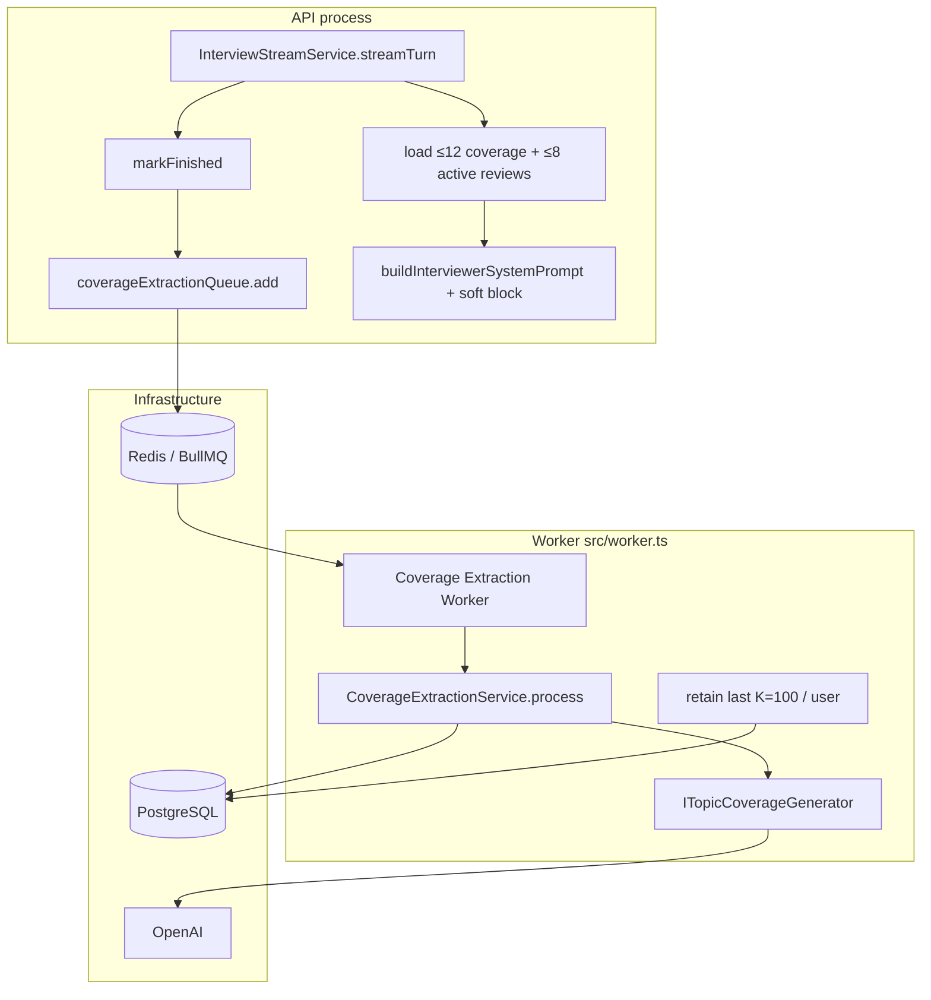

# Interview Soft Coverage — Design

**Spec**: `backend/.specs/features/interview-soft-coverage/spec.md`  
**Context**: `backend/.specs/features/interview-soft-coverage/context.md`  
**Status**: Approved (tasks drafted)

---

## Architecture Overview

Two paths, both backend-only:

1. **Write path (async):** On final practice turn, after `markFinished`, enqueue a dedicated BullMQ job (same worker process as review/weak-answer). Worker runs an LLM with structured output `{ topic, angle }[]` (max 8), appends rows to `topic_coverage`, then prunes the user to the newest **100** rows.

2. **Read path (hot):** On every `streamTurn`, load ≤12 recent coverage rows + ≤8 active review items for the user and pass them into the interviewer system prompt as a soft-guidance section. No hard exclude, no FE changes, no session status polling.



```mermaid
sequenceDiagram
  participant FE as Frontend
  participant API as InterviewStreamService
  participant DB as PostgreSQL
  participant Q as BullMQ coverage-extraction
  participant W as CoverageExtractionService

  Note over FE,API: Mid / first turns — soft guide
  FE->>API: POST .../stream
  API->>DB: listRecentCoverage(userId, 12)
  API->>DB: listActiveReviews(userId, 8)
  API->>API: graph.streamMessages(+ soft hints in system prompt)
  API-->>FE: SSE tokens

  Note over FE,W: Final turn — extract coverage
  FE->>API: POST .../stream (final)
  API->>DB: markFinished
  API->>Q: add { sessionId } jobId=sessionId
  Note over API: enqueue fail → log only; chat stays finished
  API-->>FE: meta isFinished=true
  Q->>W: process(sessionId)
  W->>W: transcript → structured {topic,angle}≤8
  W->>DB: createMany coverage rows
  W->>DB: prune user to last 100 rows
```

---

## Code Reuse Analysis

### Existing Components to Leverage

| Component | Location | How to Use |
| --------- | -------- | ---------- |
| Weak-answer queue (best-effort analog) | `src/infrastructure/queue/weak-answer-queue.ts`, `protocols/weak-answer-queue.ts` | Mirror: `add({ sessionId })` only — **no** `remove`/retry API in MVP |
| Review-generation queue (ops pattern) | `src/infrastructure/queue/review-generation-queue.ts` | Same Redis connection, attempts/backoff, `jobId: sessionId` |
| `WeakAnswerGenerationService` | `service/weak-answer-generation-service.ts` | Mirror `process` skip rules (`not_found`, `not_finished`), token assert, transcript build, usage capture |
| Review/weak generator nodes | `infrastructure/ai/langgraph/nodes/*-generator-node.ts` | Mirror `withStructuredOutput` + `{prompt}` human template |
| Zod generator schemas | `validations/interview-schemas.ts` | Add `topicCoverageGeneratorOutputSchema` with `items.max(8)` |
| `InterviewStreamService` finish block | `service/stream-service.ts` | Third `try/catch` after weak-answer enqueue; log on failure |
| `buildInterviewerSystemPrompt` | `prompts/interviewer-system-prompt.ts` | New optional soft-coverage section |
| `interviewer-node` / graph state | `infrastructure/ai/langgraph/*` | Pass soft-hint fields into prompt builder (same path as résumé/JD) |
| `ReviewRepository.listByUserId` | `repository/review-repository.ts` | Filter `status === "active"` in coverage loader; sort high→medium→low; take 8 |
| `stream-service-factory` / `worker.ts` | factories + worker | Wire queue + register third worker |
| `createUsageCaptureCallback` / `TokenUsageService` | token-usage module | Worker path assert + record like weak answers |

### Integration Points

| System | Integration Method |
| ------ | ------------------ |
| Prisma `ai-mock-interview.prisma` | New `TopicCoverage` model + relations on `User` / `InterviewSession` |
| BullMQ | New queue name `coverage-extraction` |
| Interviewer SSE | **No** new `meta` fields required for MVP |
| Session API / FE | **No** contract changes for MVP |
| Docker worker | Same `bun run worker` — register extra `Worker` |

### Fragile areas / mitigations

| Concern | Mitigation |
| ------- | ---------- |
| Final-turn latency | Enqueue only (like weak answers); never await LLM in SSE |
| LangGraph state overwrite | Soft hints loaded **each** `streamTurn` (same as résumé today) — avoids empty-array clobbering checkpoint; content is stable for the session because this session’s coverage job has not written yet |
| Review repo has no status filter | Filter in loader service; optional `listActiveByUserId` if we want a single query (nice-to-have) |
| Duplicate jobs | `jobId: sessionId`; process idempotent via “if rows already exist for sessionId → skip” |
| FE concerns (SSE meta / session list) | No new FE fields → no impact |

---

## Components

### Prisma: `TopicCoverage`

- **Purpose**: Append-only memory of topic+angle covered in finished practice sessions
- **Location**: `backend/prisma/schema/ai-mock-interview.prisma`
- **Model**:

```prisma
model TopicCoverage {
  id        String   @id @default(uuid())
  userId    Int      @map("user_id")
  sessionId String   @map("session_id")
  topic     String
  angle     String
  createdAt DateTime @default(now()) @map("created_at")

  user    User             @relation(fields: [userId], references: [id], onDelete: Cascade)
  session InterviewSession @relation(fields: [sessionId], references: [id], onDelete: Cascade)

  @@map("topic_coverage")
  @@index([userId, createdAt(sort: Desc)])
  @@index([sessionId])
}
```

- Add `topicCoverages TopicCoverage[]` on `User` and `InterviewSession`
- **No** unique on `(userId, topic)` — multiple angles/history must coexist (ISC-05)

### Zod: `topicCoverageGeneratorOutputSchema`

- **Location**: `validations/interview-schemas.ts`
- **Shape**:

```typescript
const topicCoverageItemSchema = z.object({
  topic: z.string().trim().min(1).max(120),
  angle: z.string().trim().min(1).max(200),
});

export const topicCoverageGeneratorOutputSchema = z.object({
  items: z.array(topicCoverageItemSchema).max(8),
});
```

- Empty `items` allowed (ISC-06)
- Schema `.max(8)` enforces ISC-03; prompt also instructs “most salient ≤8”

### Protocol: `ICoverageExtractionQueue`

- **Location**: `modules/interview/protocols/coverage-extraction-queue.ts`
- **Interfaces**:
  - `add(params: { sessionId: string }): Promise<void>`
- **Reuses**: Weak-answer queue protocol shape (no `remove` in MVP)

### Queue: `coverage-extraction-queue.ts`

- **Location**: `infrastructure/queue/coverage-extraction-queue.ts`
- **Details**: Queue name `"coverage-extraction"`; job `"extract"`; `jobId: sessionId`; attempts 3; exponential backoff 2s; `removeOnComplete: true`; `removeOnFail: false`; shared `redisConnection`

### Protocol: `ITopicCoverageGenerator`

- **Location**: `modules/interview/protocols/topic-coverage-generator.ts`
- **Interfaces**:
  - `generate(params: { transcript: string; interviewLocale: InterviewLocale; jobDescription?: string | null }, options?: { callbacks? }): Promise<{ items: { topic: string; angle: string }[] }>`

### Generator node + adapter + prompt

- **Node**: `infrastructure/ai/langgraph/nodes/topic-coverage-generator-node.ts` — mirror weak-answers node (`createReviewModel().withStructuredOutput`, `{prompt}` template, `schema.parse`)
- **Adapter**: `infrastructure/ai/langgraph/topic-coverage-generator-adapter.ts`
- **Prompt**: `modules/interview/prompts/topic-coverage-generator-prompt.ts`
  - Instruct: extract representative **topic + angle** pairs actually explored in the transcript; max 8; short phrases; do not invent topics not discussed; angles free-text (e.g. trade-offs, debugging, design); respect interview locale for topic/angle strings when the interview was in that locale
  - Meta instructions may be English (agent discretion); extracted strings follow interview language

### Repository: `TopicCoverageRepository`

- **Location**: `modules/interview/repository/topic-coverage-repository.ts`
- **Interfaces**:
  - `createMany(rows: { userId; sessionId; topic; angle }[]): Promise<void>`
  - `listRecentByUserId(userId: number, limit: number): Promise<TopicCoverageRecord[]>` — `orderBy: { createdAt: "desc" }`, `take: limit`
  - `countBySessionId(sessionId: string): Promise<number>` — idempotency check
  - `pruneOldestBeyondLimit(userId: number, keep: number): Promise<number>` — delete rows not in the newest `keep` by `createdAt desc` (implement via raw SQL or find ids to keep + `deleteMany` where id not in keep set)

### Service: `CoverageExtractionService`

- **Purpose**: Worker entry — extract, persist, prune
- **Location**: `modules/interview/service/coverage-extraction-service.ts`
- **Interfaces**:
  - `process(sessionId: string): Promise<{ status: "ready" \| "skipped"; sessionId: string; reason?: string }>`
- **Flow**:
  1. Load session → skip if missing / not finished
  2. If `countBySessionId > 0` → skip `already_processed` (idempotent redelivery)
  3. `assertWithinLimit(userId)` — on quota failure, log + return skipped/failed-without-throw policy consistent with weak-answer (Design: **throw** for transient LLM errors so BullMQ retries; for `TokenLimitExceededError` skip without throw and log — mirror review-generation’s permanent handling as closely as weak-answer does today)
  4. Build transcript from `MessageRepository.listBySessionId`
  5. `generator.generate(...)` + record token usage
  6. Drop empty topic/angle after trim; `createMany` remaining (≤8)
  7. `pruneOldestBeyondLimit(userId, 100)`
  8. Return `ready`
- **Dependencies**: Session/Message repos, generator, TopicCoverageRepository, TokenUsageService
- **Reuses**: Weak-answer process skeleton

### Constants

```typescript
export const TOPIC_COVERAGE_MAX_PER_SESSION = 8;
export const TOPIC_COVERAGE_PROMPT_LIMIT = 12;
export const TOPIC_COVERAGE_RETENTION_PER_USER = 100;
export const ACTIVE_REVIEW_PROMPT_LIMIT = 8;
```

Location: e.g. `modules/interview/constants/topic-coverage.ts` (or colocated with service)

### Loader: soft-hint assembly (used by stream)

- **Purpose**: Build capped lists for the interviewer prompt
- **Location**: Prefer a small helper/service e.g. `modules/interview/service/soft-coverage-prompt-loader.ts` (or private methods on stream service — prefer extracted helper for testability)
- **Interfaces**:
  - `loadSoftCoverageHints(userId: number): Promise<{ coverage: { topic; angle; createdAt }[]; activeReviews: { topic; priority; description? }[] }>`
- **Rules**:
  - Coverage: `listRecentByUserId(userId, 12)`
  - Reviews: `listByUserId` → filter `active` → sort priority `high` > `medium` > `low` (then `updatedAt` desc) → take 8
  - Include short `description` only if cheap/already loaded; cap description length in prompt formatter (~120 chars) to protect token budget

### Prompt: soft coverage block

- **Location**: extend `interviewer-system-prompt.ts`
- **Section header**: e.g. `## Prior coverage (soft guidance)`
- **When both lists empty**: omit section entirely (ISC-17)
- **When partial**: render whichever list is non-empty (ISC-18)
- **Normative instructions** (English meta-copy):

  - Prefer topics/angles **not** in the recent coverage list
  - Do **not** repeat the same topic **and** same angle recently covered
  - Active review topics are known weaknesses: you **may** touch them lightly with a **different** angle; do **not** drill the whole list or try to “finish” mastery — that is Study
  - Topics covered without appearing as active reviews are lower priority; if revisited, use a different angle
  - Still run a natural interview grounded in résumé / JD; this block is guidance, not a script

- Approximate budget: ≤12 lines coverage + ≤8 review lines ≈ **300–500 tokens** (ISC-23)

### `InterviewStreamService` changes

- **Constructor**: add `ICoverageExtractionQueue` (+ soft-hint loader or repos)
- **Each turn** (before `graph.streamMessages`):
  - `loadSoftCoverageHints(userId)`
  - Pass into graph input / interviewer prompt params
- **Final turn** (after weak-answer enqueue try/catch):

```typescript
try {
  await this.coverageExtractionQueue.add({ sessionId });
} catch (enqueueErr) {
  logStreamError({ flow: "interview", userId, sessionId, err: enqueueErr });
}
```

- **Does not** set any new session status column (MVP)

### Graph state / interviewer node

- Extend `InterviewGraphStateAnnotation` + `InterviewGraphInput` with optional:
  - `recentCoverage: { topic: string; angle: string }[]`
  - `activeReviewTopics: { topic: string; priority: string; description?: string }[]`
- `interviewerNode` passes these into `buildInterviewerSystemPrompt` / chat template params
- Closing-feedback path (`runReview === true`) **omits** soft-coverage block (not needed for closing)

### Factories + worker

- `factories/interview/coverage-extraction-service-factory.ts` → `makeCoverageExtractionService()`
- Wire queue into `stream-service-factory.ts`
- `worker.ts`: register `Worker` on `coverage-extraction` with concurrency 1; log `ready`/`skipped`; on exhausted failure → structured error log with `sessionId` (P2 observability — **no** DB status column in MVP)

---

## Data Models

### `TopicCoverageRecord` (app layer)

```typescript
interface TopicCoverageRecord {
  id: string;
  userId: number;
  sessionId: string;
  topic: string;
  angle: string;
  createdAt: Date;
}
```

**Relationships**: N coverage rows per `InterviewSession`; N per `User`; cascade delete with session/user.

### Soft hint DTO (prompt only — not persisted)

```typescript
interface SoftCoverageHints {
  coverage: Array<{ topic: string; angle: string; createdAt: Date }>;
  activeReviews: Array<{
    topic: string;
    priority: "high" | "medium" | "low";
    description?: string;
  }>;
}
```

---

## Error Handling Strategy

| Error Scenario | Handling | User Impact |
| -------------- | -------- | ----------- |
| Coverage enqueue fails on final turn | Log; session stays finished | None — next practice may lack newest session’s coverage until a later successful run (best-effort) |
| Coverage job LLM / transient failure | BullMQ retries (3) | Delayed or missing coverage for that session |
| Coverage job exhausted failures | Structured log with `sessionId` (P2) | Practice continues; no FE error |
| Token limit on worker | Skip + log (do not clear `isFinished`) | No coverage rows for that session |
| Soft-hint load fails mid-turn | Log; proceed **without** soft block (degrade to today’s prompt) | Possible more repetition that turn; interview still works |
| Empty transcript / zero items | Persist nothing; prune still OK; status ready/skipped success | None |
| Duplicate job redelivery | Skip if session already has coverage rows | None |

---

## Tech Decisions

| Decision | Choice | Rationale |
| -------- | ------ | --------- |
| Table name | `TopicCoverage` / `topic_coverage` | Matches earlier deferred naming; clear domain term |
| Enqueue semantics | Like **weak answers** (log-only on fail; no session status) | Spec: best-effort; avoid FE/API surface |
| Soft-hint load timing | **Every** `streamTurn` (not turn-0-only checkpoint tricks) | Matches résumé reload pattern; avoids LangGraph empty overwrite; DB cost negligible |
| “Once per session” meaning | Soft block is prior-session guidance in the **system** prompt (not per-turn context message); lists don’t include the in-progress session’s extraction | Aligns product intent with brownfield graph |
| Angle representation | Free-text only; Zod max lengths | Locked in context; structured output for shape |
| Retention | Prune after each successful insert to newest 100 | ISC-11–14; simple, no TTL cron |
| Idempotency | Skip process if any row exists for `sessionId` | Safe with `jobId: sessionId` redelivery |
| P2 observability | Structured worker logs only (no Prisma status column) | Enough for ops; keeps MVP thin; can add column later |
| Closing turn | No soft-coverage section | Closing feedback has its own prompt |
| Active review sort | `high` → `medium` → `low`, then recency | Matches “prefer higher priority first” |
| Schema over-max | Zod `.max(8)` rejects invalid LLM output → retry/fail job | Prefer fail+retry over silent slice ambiguity; prompt still says ≤8 |

---

## Requirement Mapping (Design)

| Requirement IDs | Design element |
| --------------- | -------------- |
| ISC-01, ISC-08, ISC-09 | Stream finish enqueue + queue |
| ISC-02–ISC-07, ISC-10 | Generator + service + schema |
| ISC-11–ISC-14 | `pruneOldestBeyondLimit` + K=100 |
| ISC-15–ISC-23 | Soft-hint loader + prompt section + stream/graph wiring |
| ISC-24–ISC-25 | Worker structured logs; no FE status |

**Coverage:** 25 requirements addressed in Design; Tasks phase will map 1:1 to implementation units.

---

## Testing Strategy (for Tasks)

| Layer | What |
| ----- | ---- |
| Unit | Prompt builder omits/includes sections; Zod schema max/trim; priority sort + caps; prune selection logic |
| Unit | `CoverageExtractionService` skip paths + createMany/prune calls (mocked repos) |
| Unit | `InterviewStreamService` enqueues coverage on final turn; enqueue failure still finishes |
| Integration | Repository createMany / listRecent / prune against Postgres |
| E2E (optional/light) | Finish session → worker produces rows; new session stream uses soft block (assert via prompt spy or DB presence) — exact gate in Tasks |

Mirror existing review/weak-answer test layouts under `service/*.test.ts` and `repository/*.integration.test.ts`.

---

## Out of Scope (Design confirmation)

Unchanged from spec/context: hard exclude, regenerate, embeddings, FE UI/CTA, modes, weak-answer snippets, session snapshot column, unifying LLM pass with review generation.
