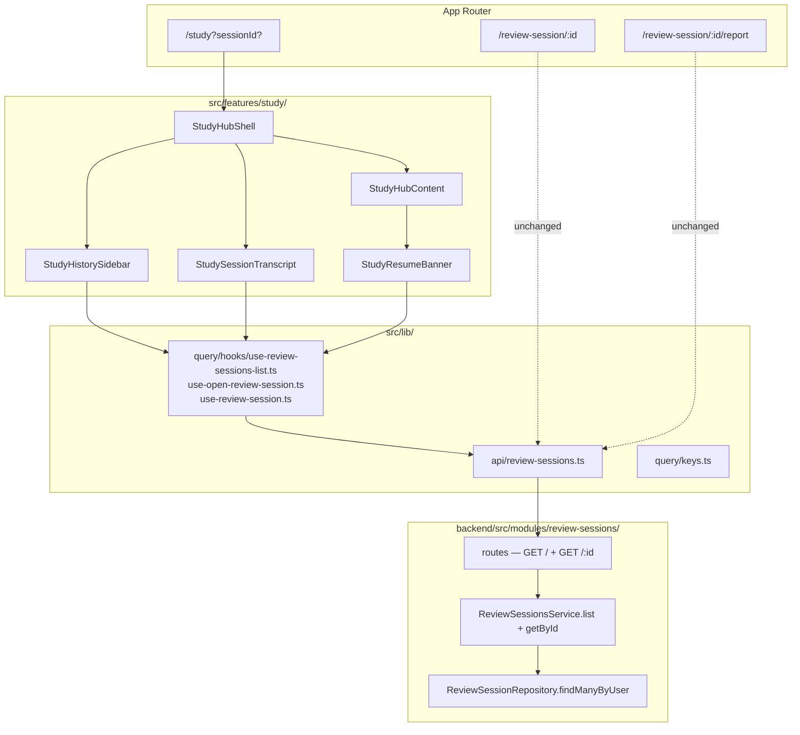
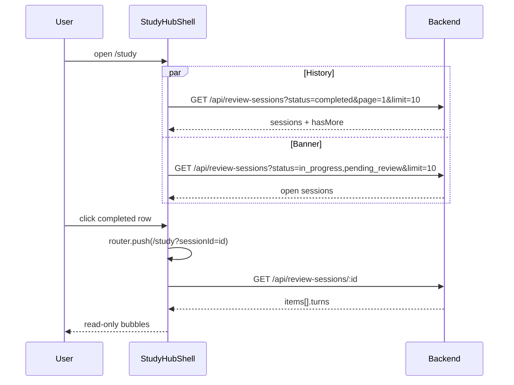

# Study Session History — Design

**Spec**: `.specs/features/study-session-history/spec.md`  
**Context**: `.specs/features/study-session-history/context.md`  
**Status**: Approved

---

## Architecture Overview

Cross-repo feature: **backend** adds paginated list + exposes persisted `turns` on detail; **frontend** restructures `/study` into a practice-like shell (history sidebar + main panel) and renders a read-only transcript from those turns. Live Q&A/report routes stay unchanged.



### End-to-end flows



---

## Tech Decisions

| ID | Decision | Choice | Rationale |
|----|----------|--------|-----------|
| SSHIST-DES-01 | List sort | `completedAt DESC NULLS LAST`, then `createdAt DESC` | History cares about completion time; open sessions only have `createdAt` |
| SSHIST-DES-02 | Pagination FE | `useInfiniteQuery` + **Load more** button (page size 10) | Spec requires pagination; no existing infinite pattern — adopt TanStack infinite for append UX |
| SSHIST-DES-03 | Open-session source of truth | List API (`status=in_progress,pending_review`); pick newest by `createdAt` | Overturns Study Hub `STUDY-DES-02` storage-only; `sessionStorage` remains write-through hint only (optional, non-authoritative) |
| SSHIST-DES-04 | Route registration | Register `GET /` **before** `GET /:id` | Express param route would otherwise swallow list |
| SSHIST-DES-05 | Turns on GET detail | Always include `turns` on each report item (all statuses) | Cheap; enables future resume hydration; transcript needs it for `completed` |
| SSHIST-DES-06 | Transcript mapping | Per-item: topic divider → for each turn AI(`question`) then human(`answer`) | Matches live chat topic dividers (`STUDY-DES-04`); turns already `{ question, answer }` |
| SSHIST-DES-07 | Deep-link guard | Resolve `sessionId` via `useReviewSession`; branch on `status` before rendering transcript | Single fetch drives redirect vs transcript vs 404 clear |
| SSHIST-DES-08 | Hub vs transcript panel | Mutual exclusive in main pane; `sessionId` present + `completed` → transcript; else hub (after redirects) | Keeps Active/Learned UX intact when not viewing history |
| SSHIST-DES-09 | Topic row truncation | CSS `line-clamp-2` / `truncate` on joined topics (`", "`); full topics visible in transcript dividers | Spec edge case; no tooltip required for MVP |
| SSHIST-DES-10 | Date display | Prefer `completedAt`, fallback `createdAt`; `toLocaleDateString` like practice sidebar | Matches SSHIST-DEC-04 |
| SSHIST-DES-11 | List query `status` | Zod: comma-separated enum values → `ReviewSessionStatus[]` (min 1) | One endpoint for banner + history |
| SSHIST-DES-12 | `hasMore` | Fetch `limit + 1` rows; return first `limit`; `hasMore = rows.length > limit` | Avoids separate `count(*)` |
| SSHIST-DES-13 | Invalidate after Apply | Invalidate `reviewSessionsList` (completed + open) when apply succeeds / report navigates to `/study` | New completed row appears immediately |
| SSHIST-DES-14 | Mobile layout | Mirror `/practice`: sidebar stacks above main (`max-h` + scroll), full-width on small screens | Locked familiarity |

---

## Backend Design

### Route

```ts
// review-sessions-routes.ts — order matters
router.get("/", validate(listReviewSessionsQuerySchema, "query"), asyncHandler(controller.list));
router.get("/:id", asyncHandler(controller.getById));
// existing POST /, POST /:id/stream, POST /:id/apply unchanged
```

### Query schema (Zod)

```ts
status: z.string().transform(parseCommaStatuses).pipe(z.array(reviewSessionStatusSchema).min(1))
page: z.coerce.number().int().min(1).default(1)
limit: z.coerce.number().int().min(1).max(50).default(10)
```

`parseCommaStatuses`: split on `,`, trim, reject empty tokens → 422 via Zod.

### Service `list(userId, { statuses, page, limit })`

1. `skip = (page - 1) * limit`
2. Repo `findManyByUserId({ userId, statuses, skip, take: limit + 1 })` with items ordered by `order asc` (topics only — select `topic`, not full turns).
3. Map to summaries: `{ id, status, topics: items.map(i => i.topic), createdAt: ISO, completedAt: ISO | null }`
4. Return `{ sessions: first limit, page, limit, hasMore }`

### Service `getById` / `toReportItem`

Add `turns: ReviewSessionTurn[]` to report item DTO (already on record).

### Repository

New method:

```ts
findManyByUserId(params: {
  userId: number;
  statuses: ReviewSessionStatus[];
  skip: number;
  take: number;
}): Promise<ReviewSessionRecord[]>
```

Prisma:

- `where: { userId, status: { in: statuses } }`
- `orderBy: [{ completedAt: "desc" }, { createdAt: "desc" }]`
- `include: { items: { orderBy: { order: "asc" }, select: { topic: true, order: true, /* minimal */ } } }`  
  Prefer a lean include for list (topics only) vs full `toReviewSessionRecord` — either a dedicated list mapper or full record then map topics. **Prefer lean query** for list performance.

### Docs

Update `backend/docs/frontend-mock-interview-api.md`: document `GET /api/review-sessions`, pagination, and `turns` on GET `/:id`.

### E2E

Extend `review-sessions.e2e.test.ts`:

- List empty → `{ sessions: [], hasMore: false }`
- After complete → appears under `status=completed`
- Open session appears under open filter, not completed
- Pagination: seed >10 completed, page 1 `hasMore: true`, page 2 distinct ids
- GET `/:id` includes `turns` after stream answers

---

## Frontend Design

### Module & file layout

```
src/
  types/review-sessions.ts          # + ReviewSessionSummary, ListResponse, turns on items
  lib/api/review-sessions.ts        # + list()
  lib/query/keys.ts                 # + reviewSessionsList(statusKey, page?) / infinite key
  lib/query/hooks/
    use-review-sessions-list.ts     # infinite query for completed
    use-open-review-sessions.ts     # list open statuses (replace storage-primary hook)
    use-open-review-session.ts      # thin: newest open from use-open-review-sessions
    use-review-session.ts           # unchanged (now receives turns)
  features/study/
    study-hub-shell.tsx             # NEW — sidebar + main; reads searchParams
    study-history-sidebar.tsx       # NEW — list + load more + empty/error
    study-history-row.tsx           # NEW — topics, date, badge, active highlight
    study-session-transcript.tsx    # NEW — read-only bubbles from turns
    lib/turns-to-display-messages.ts # NEW — turns → ReviewDisplayMessage[]
    study-hub-content.tsx           # becomes main-panel hub only (no page chrome change beyond shell)
    study-resume-banner.tsx         # switch data source to open-list hook
    review-session-report.tsx       # invalidate history list keys on successful apply
  app/(app)/study/page.tsx          # render StudyHubShell (Suspense for useSearchParams)
```

### Component contracts

#### `StudyHubShell`

- **Purpose**: Practice-like layout; owns `sessionId` from `useSearchParams` and panel switching.
- **Location**: `src/features/study/study-hub-shell.tsx`
- **Behavior**:
  - Left: `StudyHistorySidebar`
  - Main: if resolving session → loading; if redirect needed → `router.replace`; if `completed` → `StudySessionTranscript`; else → `StudyHubContent` (+ banner inside hub or above panel)
- **Reuses**: Layout classes / structure from `practice/page.tsx` aside + section pattern

#### `StudyHistorySidebar`

- **Purpose**: Completed history list + Load more.
- **Hooks**: `useReviewSessionsInfinite({ status: "completed", limit: 10 })`
- **UI**: Header “Previous review sessions”; rows; Load more when `hasNextPage`; empty via `AppEmptyState`
- **Select**: `router.push(/study?sessionId=id)`

#### `StudySessionTranscript`

- **Purpose**: Read-only Q&A for one completed session.
- **Props**: `sessionId: string`
- **Hooks**: `useReviewSession(sessionId)`
- **Render**: Map via `turnsToDisplayMessages` → reuse `InterviewMessageList` / bubbles (no `InterviewChatInput`)
- **Chrome**: Optional back control clearing `sessionId` (`router.push("/study")`)

#### `turnsToDisplayMessages(items)`

```ts
// For each item in order:
//   appendTopicDivider(topic, index)
//   for each turn: appendAiMessage(question); appendHumanMessage(answer)
// Use stable ids: `${item.id}-t${i}-q` / `-a` (not random) for SSR/hydration safety
```

#### Open sessions hook

```ts
useOpenReviewSessions() // queryKey: reviewSessionsList("open")
// GET status=in_progress,pending_review&page=1&limit=10
// return sessions sorted client-side by createdAt desc if API already sorts

useOpenReviewSession() // returns sessions[0] or null for banner
```

Remove hard dependency on `getLastReviewSessionId()` for banner visibility. Keep writing last id on create as optional optimization (agent discretion — default: **keep write**, stop using it as primary read).

### Query keys

```ts
reviewSessionsList: (filter: string) => ["review-sessions", "list", filter] as const
// filter examples: "completed" | "open"
// infinite query uses same key; pages in queryFn pageParam
```

Invalidate on apply success:

```ts
queryClient.invalidateQueries({ queryKey: ["review-sessions", "list"] })
queryClient.invalidateQueries({ queryKey: queryKeys.reviewSession(id) })
queryClient.invalidateQueries({ queryKey: ["review-items"] }) // existing
```

### Types

```ts
export type ReviewSessionTurn = {
  question: string;
  answer: string;
};

export type ReviewSessionSummary = {
  id: string;
  status: ReviewSessionStatus;
  topics: string[];
  createdAt: string;
  completedAt: string | null;
};

export type ListReviewSessionsResponse = {
  sessions: ReviewSessionSummary[];
  page: number;
  limit: number;
  hasMore: boolean;
};

// ReviewSessionItemReport extends with:
turns: ReviewSessionTurn[];
```

### API client

```ts
list(
  token: string,
  params: { status: string; page?: number; limit?: number },
): Promise<ListReviewSessionsResponse>
```

Query string via `URLSearchParams`.

---

## Code Reuse Analysis

| Component | Location | How to use |
|-----------|----------|------------|
| Practice sidebar layout | `src/app/(app)/practice/page.tsx` | Structure, row styling, Finished/Active badge patterns → Completed |
| `AppEmptyState` | `src/components/app/app-empty-state.tsx` | Empty history |
| `InterviewMessageList` / bubbles | `src/features/interview/*` | Transcript rendering |
| `review-display-messages` | `src/features/study/lib/review-display-messages.ts` | Extend with stable-id builders or new `turns-to-display-messages` |
| `useReviewSession` | existing | Detail + turns |
| `StudyResumeBanner` | existing | Swap hook only |
| `StudyHubContent` | existing | Nest inside shell main panel |
| `apiRequest` / `ApiError` | `src/lib/api/client.ts` | List + detail errors |
| `validate` query pattern | review-items list | Backend list query validation |
| Repository `findByIdAndUserId` | review-session-repository | Pattern for ownership-scoped queries |

### CONCERNS.md mitigations

| Concern | Mitigation |
|---------|------------|
| Client-only auth | Unchanged; backend ownership on list/detail |
| Full session list payload (interview) | Review list is **lean** (topics only); turns only on detail click |
| No FE automated tests | Gates: lint + check-types + build; BE E2E for list/turns; manual UAT checklist |

---

## Error Handling Strategy

| Scenario | Handling | User impact |
|----------|----------|-------------|
| List completed fails | Sidebar error text; hub still works | Can study; cannot browse history |
| Open list fails | Banner hidden; toast optional | Resume may be missing until retry |
| GET detail 404 | Clear `sessionId`, toast, show hub | Recovered selection |
| GET detail network error | Transcript error + Retry | Stay on `?sessionId=` |
| `sessionId` is open status | `replace` to live/report route | Correct resume path |
| Empty turns on completed | Empty transcript state copy | No crash |
| Load more fails | Toast; keep prior pages | Partial history visible |

---

## Data flow — Apply → History

1. User applies report → session `completed`.
2. Report success handler invalidates `["review-sessions", "list"]` + review-items.
3. Navigate `/study` → infinite query refetch → new row at top.
4. Optional: `clearLastReviewSessionId()` (session no longer open).

---

## Testing Strategy

| Layer | What |
|-------|------|
| Backend unit | Zod list schema (status parsing, defaults); service list mapping + hasMore |
| Backend integration | Repo findMany filters + order |
| Backend E2E | List/pagination/turns on GET (above) |
| Frontend | `turnsToDisplayMessages` unit test (pure) — optional but cheap |
| Gate | BE: existing test script for module; FE: `lint` + `check-types` + `build` |
| UAT | Complete session → history row → transcript → refresh → Load more with 11+ sessions; banner across “devices” (clear storage, still see open via API) |

---

## Implementation Order (for Tasks phase)

1. **BE** list endpoint + E2E  
2. **BE** turns on GET `/:id` + E2E + docs  
3. **FE** types + API `list` + query keys/hooks  
4. **FE** shell + sidebar (list UI) wired to API  
5. **FE** transcript + deep-link redirects  
6. **FE** banner migration + apply invalidation  
7. Docs / parent STUDY-DES-02 note as superseded for open discovery  

---

## Supersedes (Study Hub)

| Prior decision | New stance |
|----------------|------------|
| `STUDY-DES-02` (storage + GET by id for banner) | Banner uses list API (`SSHIST-DES-03`) |
| `STUDY-DES-03` (no server message history for UI) | **Completed** transcript reads server `turns`; live in-progress chat remains local-only until a future hydrate feature |
| `BE-STUDY-02` optional list | **Required** for this feature |

---

## TLC Scope Notes

- Design covers BE + FE; Tasks should mark BE tasks as gates for FE transcript/list stories.
- Confirm this design before Tasks breakdown.

---

**Next step:** Approve design → **Tasks** (`tasks.md`).
