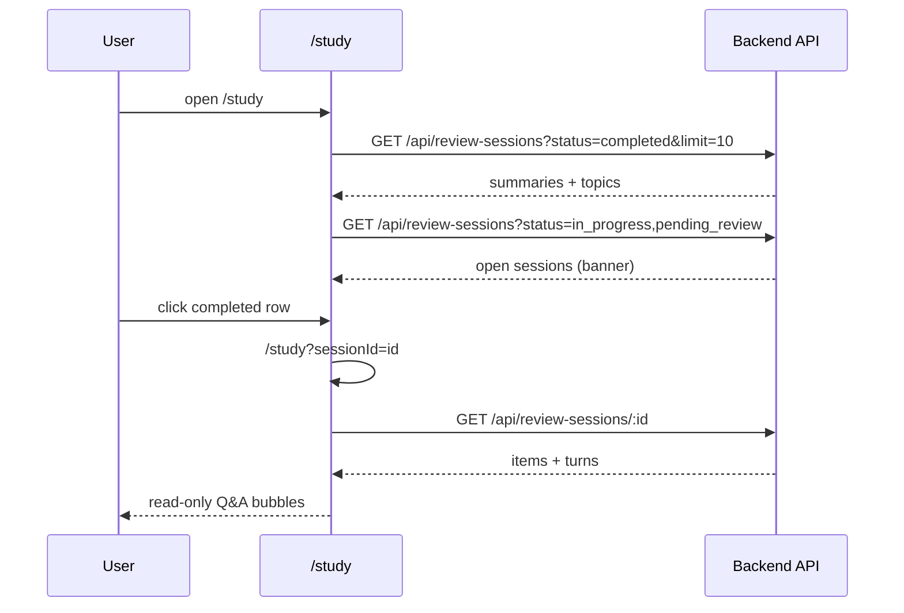

# Study Session History — Specification

## Problem Statement

Candidates complete Review Sessions on `/study`, but once a session is `completed` it disappears from the UI. The parent Study Hub feature deferred **completed session history**; practice interviews already keep a durable sidebar of past conversations. Without a persisted history of review sessions, candidates cannot revisit what they practiced or prove continuity of study work.

## Goals

- [ ] Authenticated users see a **persisted** list of `completed` Review Sessions on `/study`, similar to `/practice` history.
- [ ] Users open a past session and read a **read-only** Q&A transcript rebuilt from server-stored turns.
- [ ] Open sessions (`in_progress` / `pending_review`) remain discoverable via the existing resume banner, backed by the same list API (not client storage alone).
- [ ] Backend exposes list + turn data required for history; frontend does not invent transcript from local state.

## Out of Scope

| Item | Reason |
|------|--------|
| Applied outcomes / report replay for `completed` sessions | Grilling: transcript-only MVP |
| Showing `in_progress` / `pending_review` inside the history sidebar | Open sessions stay on resume banner only |
| Editable replay, re-apply, or restarting a completed session | History is read-only |
| Deleting history entries | Not requested |
| Portuguese UI copy | English, consistent with Study Hub (`STUDY-DEC-08`) |
| Spaced repetition / analytics over history | Separate product features |
| Changing live Q&A / report Apply flows | Owned by `study-hub-review-sessions` |

---

## Relationship to Existing Features

| Feature / doc | Link | Impact |
|---------------|------|--------|
| Study Hub & Review Sessions | [spec.md](../study-hub-review-sessions/spec.md) | Parent feature; deferred “Completed session history”; this feature delivers it |
| Study Hub design | [design.md](../study-hub-review-sessions/design.md) | Overturns “local-only message persistence” for **completed** transcript view (turns already on server) |
| Practice history UI | `src/app/(app)/practice/page.tsx` | Layout reference (sidebar + main pane) |
| Review sessions API docs | `backend/docs/frontend-mock-interview-api.md` | Extend with list + turns on GET |
| Resume banner | `src/features/study/study-resume-banner.tsx` | Migrate data source to list endpoint |
| Open session hook | `src/lib/query/hooks/use-open-review-session.ts` | Today uses `sessionStorage` last-id; replace/augment with API list |

**Brownfield touchpoints:**

| Area | Current state | Change |
|------|---------------|--------|
| `GET /api/review-sessions/:id` | Report fields only — **no `turns`** | Include per-item `turns` (`{ question, answer }[]`) |
| `GET /api/review-sessions` | **Missing** | Add list with `status`, pagination |
| `/study` layout | Full-width Active \| Learned hub | Practice-like: sidebar history + main panel |
| `reviewSessionsApi` | `create`, `getById`, `apply` | Add `list(...)` |
| Query keys / hooks | Session-by-id + storage-based open session | List hooks + banner uses open-status filter |

---

## Prerequisites (Backend)

Hard blockers before frontend history/transcript stories ship:

### 1. `GET /api/review-sessions` (new — list)

**Query:**

| Param | Rules |
|-------|-------|
| `status` | Required or defaulted — support `completed`, `in_progress`, `pending_review`, and comma-separated combinations (e.g. `in_progress,pending_review`) |
| `page` | 1-based; default `1` |
| `limit` | Default **10** for `completed`; open-status queries MAY use a higher default or same limit |

**Response (200) — lightweight summaries only:**

```json
{
  "sessions": [
    {
      "id": "uuid",
      "status": "completed",
      "topics": ["system design", "rest apis"],
      "createdAt": "ISO-8601",
      "completedAt": "ISO-8601"
    }
  ],
  "page": 1,
  "limit": 10,
  "hasMore": true
}
```

| Field | Rules |
|-------|-------|
| `topics` | Ordered topic strings from session items (same order as session) |
| `completedAt` | Present when `status === "completed"`; else `null` |
| Ownership | Only sessions belonging to the authenticated user |
| Sort | Newest first (`createdAt` or `completedAt` desc — Design locks exact field) |

| Status | When |
|--------|------|
| `200` | OK (empty `sessions` allowed) |
| `401` | Unauthenticated |
| `422` | Invalid query |

### 2. Enrich `GET /api/review-sessions/:id` with turns

Each item in `items` SHALL include:

```json
"turns": [
  { "question": "What is sharding?", "answer": "Splitting data across nodes" }
]
```

Turns already persist on `ReviewSessionItem.turns` (`ReviewSessionTurn`). Expose them for all session statuses so resume Q&A *may* hydrate later; **this feature only requires them for `completed` transcript**. Existing report fields remain unchanged.

---

## Decisions (resolved — grill-me 2026-07-28)

| ID | Decision |
|----|----------|
| SSHIST-DEC-01 | Sidebar layout like `/practice` (“Previous Conversations”), not dashboard table |
| SSHIST-DEC-02 | Click `completed` → read-only Q&A transcript (not report) |
| SSHIST-DEC-03 | Sidebar lists **only** `completed`; open sessions stay on resume banner |
| SSHIST-DEC-04 | Row shows topics summary + date + Completed badge |
| SSHIST-DEC-05 | `/study` = sidebar history + main panel (Active/Learned **or** transcript) |
| SSHIST-DEC-06 | `GET` list (light + topics) + `GET /:id` with turns |
| SSHIST-DEC-07 | Deep-link `/study?sessionId=...`; non-completed id → redirect to resume routes |
| SSHIST-DEC-08 | Transcript MVP = Q&A bubbles only; no input; no outcomes/report link |
| SSHIST-DEC-09 | Page size **10** with load-more / next page |
| SSHIST-DEC-10 | Single list endpoint; banner uses open statuses; history uses `completed` |

---

## User Stories

### P1: Backend list + turns exposure ⭐ MVP

**User Story**: As the Study frontend, I need a paginated list of my Review Sessions and turn data on session detail, so history and transcripts can be rebuilt after refresh.

**Why P1**: Without these APIs, UI cannot be server-persisted.

**Acceptance Criteria**:

1. WHEN an authenticated user calls `GET /api/review-sessions?status=completed&page=1&limit=10` THEN the API SHALL return only that user’s `completed` sessions, newest first, with `topics`, timestamps, and `hasMore`.
2. WHEN the user requests page 2 THEN the API SHALL return the next page of results without duplicating page 1 ids.
3. WHEN `status=in_progress,pending_review` THEN the API SHALL return only open sessions for that user (used by resume banner).
4. WHEN `GET /api/review-sessions/:id` succeeds THEN each item SHALL include `turns` as `{ question, answer }[]` reflecting persisted Q&A.
5. WHEN the session is not owned or missing THEN `GET` list/detail SHALL return `404`/`401` consistent with existing review-session auth rules.

**Independent Test**: Create and complete a session via existing E2E helpers → list returns it with topics → GET by id includes turns matching appended Q&A.

**Requirements**: SSHIST-01, SSHIST-02, SSHIST-03, SSHIST-04

---

### P1: Study hub shell — sidebar + main panel ⭐ MVP

**User Story**: As a candidate on `/study`, I want a practice-like layout with a history sidebar and a main panel, so browsing past reviews feels familiar.

**Why P1**: Structural prerequisite for list + transcript UX.

**Acceptance Criteria**:

1. WHEN the user opens `/study` without `sessionId` THEN the page SHALL show a left sidebar (history) and a main panel with Active \| Learned tabs and existing study actions (select, start session, manual actions, resume banner).
2. WHEN viewport is mobile THEN the layout SHALL remain usable (stack or scrollable sidebar pattern consistent with `/practice`).
3. WHEN history is empty THEN the sidebar SHALL show an empty state (e.g. “No previous review sessions”).
4. WHEN English copy is shown THEN new strings SHALL be English.

**Independent Test**: Open `/study` → verify sidebar + tabs coexist; existing start-session flow still navigates to `/review-session/[id]`.

**Requirements**: SSHIST-05, SSHIST-06, SSHIST-07

---

### P1: Completed history list + pagination ⭐ MVP

**User Story**: As a candidate, I want to see my last completed review sessions with topic names and dates, and load older ones, so I can find a past session.

**Why P1**: Core persisted history surface.

**Acceptance Criteria**:

1. WHEN `/study` loads THEN the UI SHALL call `GET /api/review-sessions?status=completed&limit=10&page=1` and render rows with topic summary, date, and Completed badge.
2. WHEN `hasMore` is true THEN the UI SHALL offer Load more / next page and append (or replace per Design) the next page without dropping prior items incorrectly.
3. WHEN the list request fails THEN the UI SHALL show an error state in the sidebar; main hub remains usable.
4. WHEN a new session becomes `completed` (user returns after Apply) THEN invalidating the history query SHALL refresh the sidebar.

**Independent Test**: Complete a review session → return to `/study` → session appears at top of sidebar with correct topics.

**Requirements**: SSHIST-08, SSHIST-09, SSHIST-10, SSHIST-11

---

### P1: Read-only transcript via `?sessionId=` ⭐ MVP

**User Story**: As a candidate, I want to click a completed history row and re-read the Q&A, so I can recall what I practiced.

**Why P1**: Delivers the value of history beyond a dead list.

**Acceptance Criteria**:

1. WHEN the user clicks a `completed` row THEN the UI SHALL navigate to `/study?sessionId={id}` and highlight that row.
2. WHEN `sessionId` points to a `completed` session THEN the main panel SHALL load `GET /api/review-sessions/:id` and render read-only AI/human bubbles from `turns` (no composer / no stream).
3. WHEN turns are grouped by item THEN the UI MAY show topic dividers (agent discretion if turns are per-item).
4. WHEN `sessionId` points to `in_progress` THEN the UI SHALL redirect to `/review-session/{id}`.
5. WHEN `sessionId` points to `pending_review` THEN the UI SHALL redirect to `/review-session/{id}/report`.
6. WHEN `sessionId` is unknown (`404`) THEN the UI SHALL clear the query param, toast/error, and return to the hub panel.
7. WHEN the user clears selection / navigates to `/study` without `sessionId` THEN the main panel SHALL show Active \| Learned again.

**Independent Test**: Click history row → URL has `sessionId` → bubbles match server turns; refresh keeps transcript; open-status id redirects correctly.

**Requirements**: SSHIST-12, SSHIST-13, SSHIST-14, SSHIST-15, SSHIST-16

---

### P1: Resume banner via list API ⭐ MVP

**User Story**: As a candidate with an interrupted session, I still want a resume banner, now backed by the server list of open sessions, so resume works across browsers/devices.

**Why P1**: Decision SSHIST-DEC-10; replaces fragile `sessionStorage`-only discovery.

**Acceptance Criteria**:

1. WHEN the user has one or more `in_progress` / `pending_review` sessions THEN `/study` SHALL show the resume banner for the **most recently created** open session (same preference as Study Hub STUDY-28).
2. WHEN the banner loads THEN it SHALL use `GET /api/review-sessions?status=in_progress,pending_review` (not solely last-id storage).
3. WHEN no open sessions exist THEN the banner SHALL not render.
4. WHEN the linked session returns `404` THEN the banner SHALL dismiss and the open-sessions query SHALL be invalidated.

**Independent Test**: Start session on browser A → open `/study` on browser B (same user) → banner appears without relying on local storage from A.

**Requirements**: SSHIST-17, SSHIST-18, SSHIST-19

---

## Edge Cases

- WHEN a completed session has zero turns (abnormal) THEN the transcript panel SHALL show an empty transcript state, not crash.
- WHEN `topics` has many items THEN the sidebar row SHALL truncate with ellipsis (full list available in transcript topic dividers or tooltip — Design).
- WHEN `hasMore` is false THEN Load more SHALL be hidden/disabled.
- WHEN the user is mid-multi-select on Active and clicks a history row THEN selection state MAY reset; main panel switches to transcript (hub actions not visible until `sessionId` cleared).
- WHEN list returns sessions the user no longer “owns” mid-flight THEN treat as empty/error via refetch.
- WHEN `completedAt` is null on a `completed` row THEN fall back to `createdAt` for display.

---

## API & Data Layer (frontend contract)

### Types

- `ReviewSessionSummary`: `id`, `status`, `topics: string[]`, `createdAt`, `completedAt: string | null`
- Extend session item / `ReviewSession` with `turns: Array<{ question: string; answer: string }>`
- List response: `{ sessions, page, limit, hasMore }`

### API clients

| Module | Methods |
|--------|---------|
| `review-sessions.ts` | Add `list(token, { status, page?, limit? })`; keep `getById` (now returns turns) |

### Query hooks

- `useReviewSessionsList({ status, page })` or infinite query for completed history
- Update open-session hook to prefer list of open statuses
- Invalidate history list after successful Apply / session complete

### Routes

| Route | Purpose |
|-------|---------|
| `/study` | Hub + history sidebar |
| `/study?sessionId=` | Same shell; main panel = read-only transcript |
| `/review-session/[id]` | Unchanged live Q&A |
| `/review-session/[id]/report` | Unchanged report |

---

## Architecture Overview



---

## Requirement Traceability

| Requirement ID | Story | Phase | Status |
|----------------|-------|-------|--------|
| SSHIST-01 | P1: Backend list + turns | Tasks | In Tasks |
| SSHIST-02 | P1: Backend list + turns | Tasks | In Tasks |
| SSHIST-03 | P1: Backend list + turns | Tasks | In Tasks |
| SSHIST-04 | P1: Backend list + turns | Tasks | In Tasks |
| SSHIST-05 | P1: Study hub shell | Tasks | In Tasks |
| SSHIST-06 | P1: Study hub shell | Tasks | In Tasks |
| SSHIST-07 | P1: Study hub shell | Tasks | In Tasks |
| SSHIST-08 | P1: History list | Tasks | In Tasks |
| SSHIST-09 | P1: History list | Tasks | In Tasks |
| SSHIST-10 | P1: History list | Tasks | In Tasks |
| SSHIST-11 | P1: History list | Tasks | In Tasks |
| SSHIST-12 | P1: Transcript | Tasks | In Tasks |
| SSHIST-13 | P1: Transcript | Tasks | In Tasks |
| SSHIST-14 | P1: Transcript | Tasks | In Tasks |
| SSHIST-15 | P1: Transcript | Tasks | In Tasks |
| SSHIST-16 | P1: Transcript | Tasks | In Tasks |
| SSHIST-17 | P1: Resume banner API | Tasks | In Tasks |
| SSHIST-18 | P1: Resume banner API | Tasks | In Tasks |
| SSHIST-19 | P1: Resume banner API | Tasks | In Tasks |

**Coverage:** 19 total, 19 mapped to tasks, 0 unmapped

---

## Success Criteria

- [ ] Completed Review Sessions appear on `/study` after refresh / new device (server-persisted).
- [ ] Clicking a history row shows a read-only transcript matching stored turns.
- [ ] Open sessions still resumable via banner driven by list API.
- [ ] Live Review Session Q&A and report Apply flows remain unchanged.
- [ ] All new UI strings in English.

---

## TLC Scope Assessment

**Size:** **Large** — backend list + GET enrichment, `/study` layout restructure, pagination, transcript UI, banner migration.

**Next phases after spec approval:**

1. **Design** (`design.md`) — component tree, infinite vs page query, topic truncation, exact sort field, mobile stacking.
2. **Tasks** (`tasks.md`) — BE tasks first (gate), then FE shell → list → transcript → banner.
3. **Execute** — implement per task; UAT recommended for full history walkthrough.

---

**Next step:** Review and approve this spec → **Design** (`design.md`).
